# NAAMIVE — Lifecycle Visual Guide

**Status:** NON-NORMATIVE VISUAL GUIDE  
**Versão:** 0.1  
**Natureza:** representação visual derivada dos documentos normativos  
**Vigência:** não cria vigência nem autoridade normativa  
**Snapshot de derivação:** `lifecycle-reboot` @ `73141f4983a86b580159a9e8fa17e1c5dbe1104e`

> Este arquivo existe para tornar o lifecycle do NAAMIVE mais fácil de ler por humanos.
>
> Ele **não substitui** os documentos normativos. Em caso de divergência, omissão ou
> ambiguidade, prevalecem a Constituição, os lifecycles, governance, contracts e demais
> documentos normativos aplicáveis.

---

# 1. Como ler este guia

Os diagramas usam três perspectivas:

- **Flowchart** — mostra jornada, decisões e relações entre entidades;
- **State Diagram** — mostra estados, transições, retornos e terminais;
- **Sequence Diagram** — mostra transferência de responsabilidade entre participantes.

Convenções semânticas:

```text
avanço normal        → segue o lifecycle esperado
retorno / rework     → volta por nova evidência ou decisão governada
terminal             → a instância não é reaberta
BLOCKED / PAUSED     → condição transversal; não substitui o estado principal
handoff              → responsabilidade precisa ser transferida de forma durável
gate                 → decisão sobre transição; gate não é estado
```

Documentos-base principais:

- `../01_LIFECYCLE_MODEL.md`
- `../02_NEED_LIFECYCLE.md`
- `../03_PROJECT_LIFECYCLE.md`
- `../04_MODULE_LIFECYCLE.md`
- `../05_WORK_ITEM_LIFECYCLE.md`
- `../06_EXECUTION_LIFECYCLE.md`
- `../../governance/03_GATE_POLICY.md`
- `../../contracts/02_HANDOFF_CONTRACT.md`
- `../../contracts/04_CONTINUITY_AND_RECOVERY_CONTRACT.md`
- `../../state/04_BASELINE_AND_SUPERSESSION_MODEL.md`

---

# 2. Mapa mestre — Need até Delivery e Evolution

Este é o mapa principal para leitura humana do NAAMIVE.

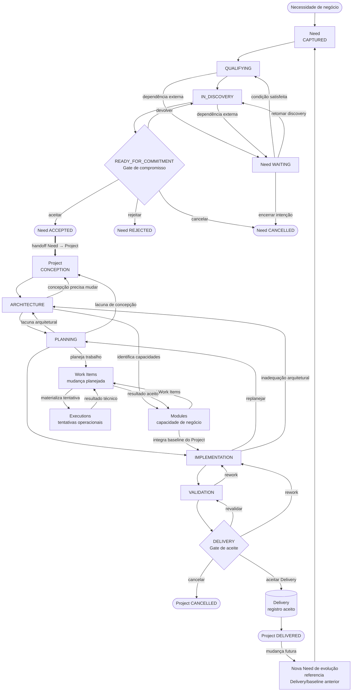
```mermaid
flowchart TD
    START([Necessidade de negócio])
    N1[Need<br/>CAPTURED]
    N2[QUALIFYING]
    N3[IN_DISCOVERY]
    N4{READY_FOR_COMMITMENT<br/>Gate de compromisso}
    NA([Need ACCEPTED])
    NR([Need REJECTED])
    NC([Need CANCELLED])
    NW[Need WAITING]

    P1[Project<br/>CONCEPTION]
    P2[ARCHITECTURE]
    P3[PLANNING]
    P4[IMPLEMENTATION]
    P5[VALIDATION]
    P6{DELIVERY<br/>Gate de aceite}
    PD([Project DELIVERED])
    PC([Project CANCELLED])

    M[Modules<br/>capacidade de negócio]
    WI[Work Items<br/>mudança planejada]
    EX[Executions<br/>tentativas operacionais]
    D[(Delivery<br/>registro aceito)]
    EVO[Nova Need de evolução<br/>referencia Delivery/baseline anterior]

    START --> N1
    N1 --> N2
    N2 --> N3
    N3 --> N4

    N4 -->|aceitar| NA
    N4 -->|devolver| N3
    N4 -->|rejeitar| NR
    N4 -->|cancelar| NC

    N2 -->|dependência externa| NW
    N3 -->|dependência externa| NW
    NW -->|condição satisfeita| N2
    NW -->|retomar discovery| N3
    NW -->|encerrar intenção| NC

    NA ==>|handoff Need → Project| P1
    P1 --> P2
    P2 --> P3
    P3 --> P4

    P2 -->|identifica capacidades| M
    P3 -->|planeja trabalho| WI
    M -->|possui Work Items| WI
    WI -->|materializa tentativa| EX
    EX -->|resultado técnico| WI
    WI -->|resultado aceito| M
    M -->|integra baseline do Project| P4

    P4 --> P5
    P5 --> P6
    P6 -->|aceitar Delivery| D
    D --> PD
    P6 -->|revalidar| P5
    P6 -->|rework| P4
    P6 -->|cancelar| PC

    PD -->|mudança futura| EVO
    EVO --> N1

    P2 -->|concepção precisa mudar| P1
    P3 -->|lacuna arquitetural| P2
    P3 -->|lacuna de concepção| P1
    P4 -->|replanejar| P3
    P4 -->|inadequação arquitetural| P2
    P5 -->|rework| P4
```

Leitura curta:

```text
Need aceita
   ↓
Project
   ↓
Modules + Work Items
   ↓
Executions
   ↓
integração
   ↓
Validation
   ↓
Delivery decision
   ↓
Delivery aceita
   ↓
Evolution volta por nova Need
```

---

# 3. Need Lifecycle — todos os caminhos principais

Fonte normativa: `../02_NEED_LIFECYCLE.md`.

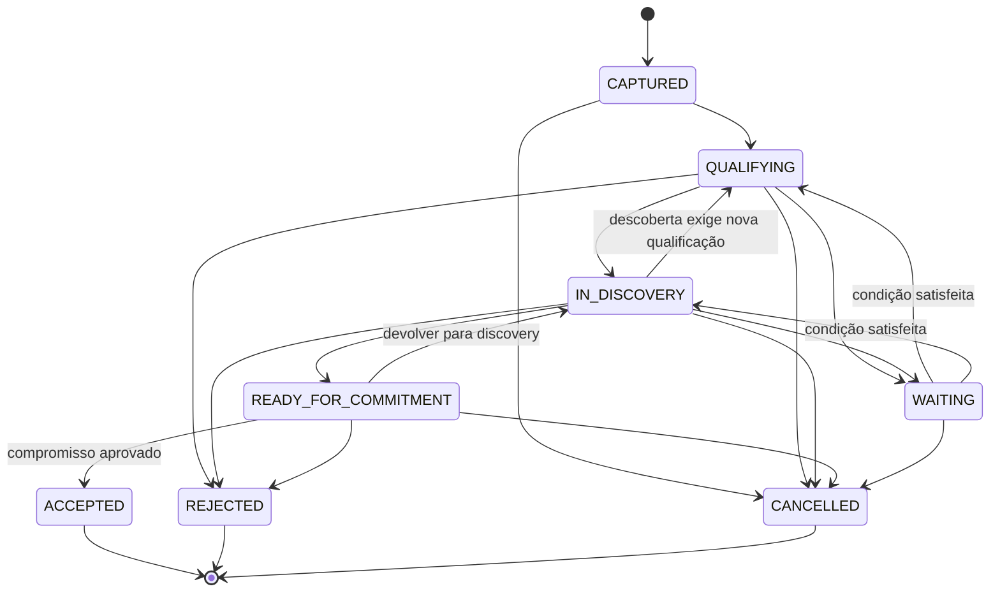
```mermaid
stateDiagram-v2
    [*] --> CAPTURED

    CAPTURED --> QUALIFYING
    CAPTURED --> CANCELLED

    QUALIFYING --> IN_DISCOVERY
    QUALIFYING --> WAITING
    QUALIFYING --> REJECTED
    QUALIFYING --> CANCELLED

    IN_DISCOVERY --> READY_FOR_COMMITMENT
    IN_DISCOVERY --> QUALIFYING: descoberta exige nova qualificação
    IN_DISCOVERY --> WAITING
    IN_DISCOVERY --> REJECTED
    IN_DISCOVERY --> CANCELLED

    READY_FOR_COMMITMENT --> ACCEPTED: compromisso aprovado
    READY_FOR_COMMITMENT --> IN_DISCOVERY: devolver para discovery
    READY_FOR_COMMITMENT --> REJECTED
    READY_FOR_COMMITMENT --> CANCELLED

    WAITING --> QUALIFYING: condição satisfeita
    WAITING --> IN_DISCOVERY: condição satisfeita
    WAITING --> CANCELLED

    ACCEPTED --> [*]
    REJECTED --> [*]
    CANCELLED --> [*]
```

Pontos de leitura:

```text
ACCEPTED  = terminal e pode originar Project
REJECTED  = terminal
CANCELLED = terminal
WAITING   = não terminal e exige causa + saída + responsável + escalada
```

Para Need `MATERIAL` ou `CRÍTICA`, o compromisso
`READY_FOR_COMMITMENT → ACCEPTED` exige autoridade humana.

---

# 4. Project Lifecycle — avanço, retornos e Delivery

Fonte normativa: `../03_PROJECT_LIFECYCLE.md`.

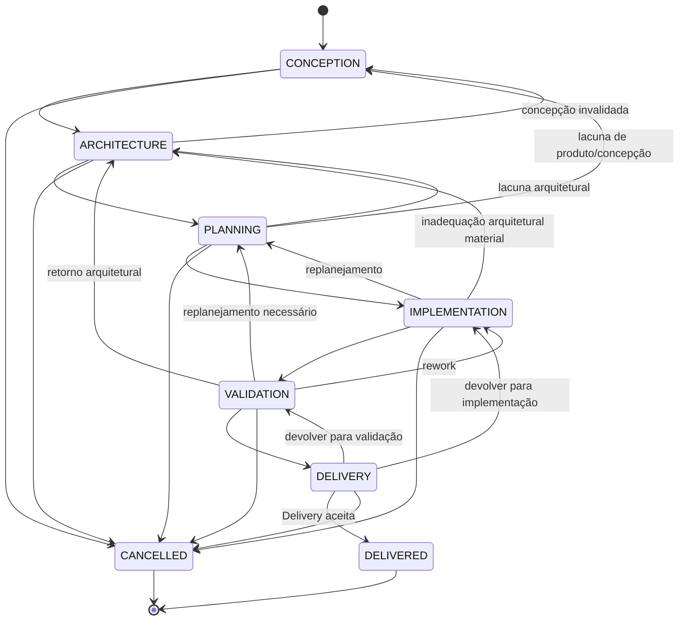
```mermaid
stateDiagram-v2
    [*] --> CONCEPTION

    CONCEPTION --> ARCHITECTURE

    ARCHITECTURE --> PLANNING
    ARCHITECTURE --> CONCEPTION: concepção invalidada

    PLANNING --> IMPLEMENTATION
    PLANNING --> ARCHITECTURE: lacuna arquitetural
    PLANNING --> CONCEPTION: lacuna de produto/concepção

    IMPLEMENTATION --> VALIDATION
    IMPLEMENTATION --> PLANNING: replanejamento
    IMPLEMENTATION --> ARCHITECTURE: inadequação arquitetural material

    VALIDATION --> DELIVERY
    VALIDATION --> IMPLEMENTATION: rework
    VALIDATION --> PLANNING: replanejamento necessário
    VALIDATION --> ARCHITECTURE: retorno arquitetural

    DELIVERY --> DELIVERED: Delivery aceita
    DELIVERY --> VALIDATION: devolver para validação
    DELIVERY --> IMPLEMENTATION: devolver para implementação

    CONCEPTION --> CANCELLED
    ARCHITECTURE --> CANCELLED
    PLANNING --> CANCELLED
    IMPLEMENTATION --> CANCELLED
    VALIDATION --> CANCELLED
    DELIVERY --> CANCELLED

    DELIVERED --> [*]
    CANCELLED --> [*]
```

Condições transversais do Project:

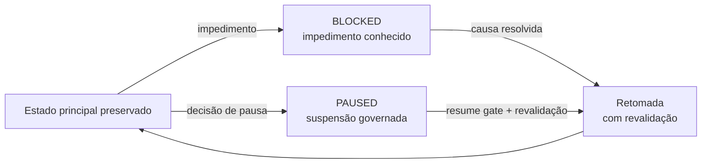
```mermaid
flowchart LR
    S[Estado principal preservado]
    B[BLOCKED<br/>impedimento conhecido]
    P[PAUSED<br/>suspensão governada]
    R[Retomada<br/>com revalidação]

    S -->|impedimento| B
    B -->|causa resolvida| R
    S -->|decisão de pausa| P
    P -->|resume gate + revalidação| R
    R --> S
```

`BLOCKED` e `PAUSED` não são estados substitutos do lifecycle principal.

---

# 5. Module Lifecycle — capacidade até integração

Fonte normativa: `../04_MODULE_LIFECYCLE.md`.

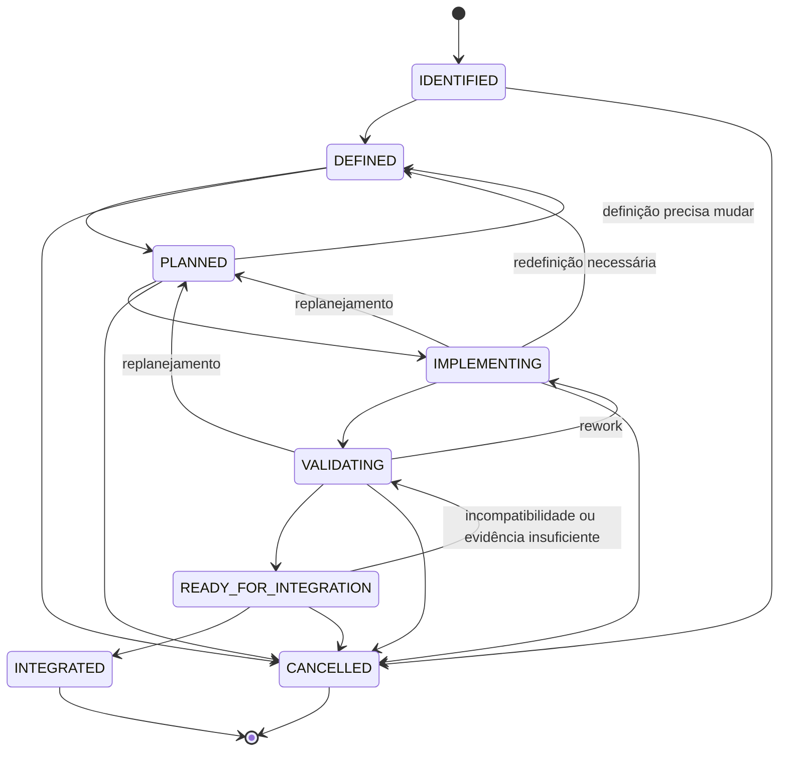
```mermaid
stateDiagram-v2
    [*] --> IDENTIFIED

    IDENTIFIED --> DEFINED
    DEFINED --> PLANNED
    PLANNED --> IMPLEMENTING
    IMPLEMENTING --> VALIDATING
    VALIDATING --> READY_FOR_INTEGRATION
    READY_FOR_INTEGRATION --> INTEGRATED

    PLANNED --> DEFINED: definição precisa mudar
    IMPLEMENTING --> PLANNED: replanejamento
    IMPLEMENTING --> DEFINED: redefinição necessária
    VALIDATING --> IMPLEMENTING: rework
    VALIDATING --> PLANNED: replanejamento
    READY_FOR_INTEGRATION --> VALIDATING: incompatibilidade ou evidência insuficiente

    IDENTIFIED --> CANCELLED
    DEFINED --> CANCELLED
    PLANNED --> CANCELLED
    IMPLEMENTING --> CANCELLED
    VALIDATING --> CANCELLED
    READY_FOR_INTEGRATION --> CANCELLED

    INTEGRATED --> [*]
    CANCELLED --> [*]
```

Correção depois de `INTEGRATED` não reabre a instância:

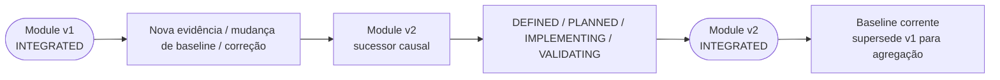
```mermaid
flowchart LR
    V1([Module v1<br/>INTEGRATED])
    CHANGE[Nova evidência / mudança de baseline / correção]
    V2[Module v2<br/>sucessor causal]
    DEF[DEFINED / PLANNED / IMPLEMENTING / VALIDATING]
    V2I([Module v2<br/>INTEGRATED])
    SUP[Baseline corrente<br/>supersede v1 para agregação]

    V1 --> CHANGE
    CHANGE --> V2
    V2 --> DEF
    DEF --> V2I
    V2I --> SUP
```

---

# 6. Work Item Lifecycle — trabalho planejado e aceite

Fonte normativa: `../05_WORK_ITEM_LIFECYCLE.md`.

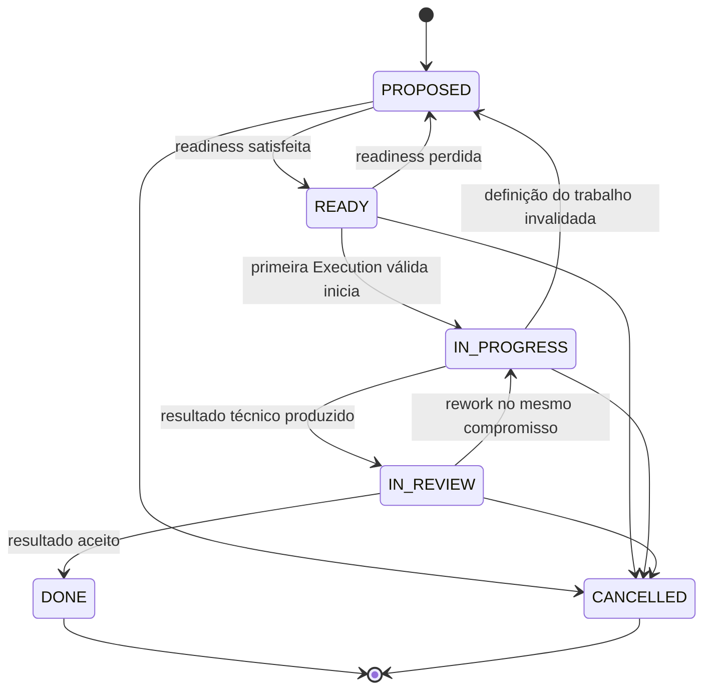
```mermaid
stateDiagram-v2
    [*] --> PROPOSED

    PROPOSED --> READY: readiness satisfeita
    READY --> IN_PROGRESS: primeira Execution válida inicia
    IN_PROGRESS --> IN_REVIEW: resultado técnico produzido
    IN_REVIEW --> DONE: resultado aceito

    READY --> PROPOSED: readiness perdida
    IN_PROGRESS --> PROPOSED: definição do trabalho invalidada
    IN_REVIEW --> IN_PROGRESS: rework no mesmo compromisso

    PROPOSED --> CANCELLED
    READY --> CANCELLED
    IN_PROGRESS --> CANCELLED
    IN_REVIEW --> CANCELLED

    DONE --> [*]
    CANCELLED --> [*]
```

Relação entre Work Item e Execution:

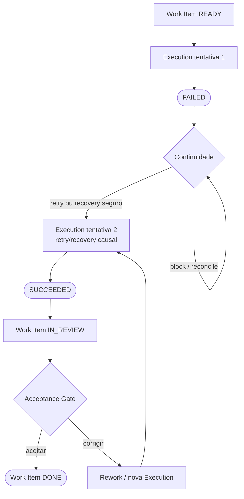
```mermaid
flowchart TD
    WI1[Work Item READY]
    E1[Execution tentativa 1]
    F1([FAILED])
    DEC{Continuidade}
    E2[Execution tentativa 2<br/>retry/recovery causal]
    S2([SUCCEEDED])
    REV[Work Item IN_REVIEW]
    G{Acceptance Gate}
    DONE([Work Item DONE])
    REWORK[Rework / nova Execution]

    WI1 --> E1
    E1 --> F1
    F1 --> DEC
    DEC -->|retry ou recovery seguro| E2
    DEC -->|block / reconcile| DEC
    E2 --> S2
    S2 --> REV
    REV --> G
    G -->|aceitar| DONE
    G -->|corrigir| REWORK
    REWORK --> E2
```

`Execution SUCCEEDED` **não** significa `Work Item DONE`.

---

# 7. Execution Lifecycle — tentativa operacional e fencing

Fonte normativa: `../06_EXECUTION_LIFECYCLE.md`.

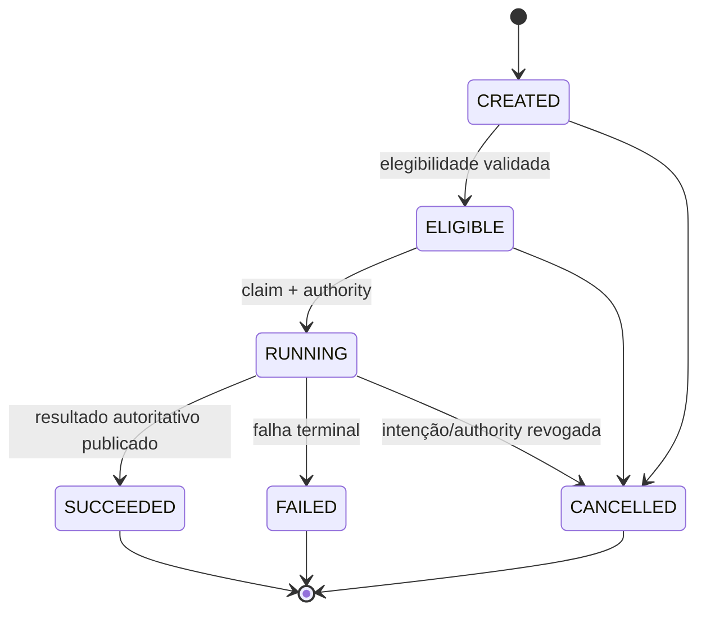
```mermaid
stateDiagram-v2
    [*] --> CREATED

    CREATED --> ELIGIBLE: elegibilidade validada
    ELIGIBLE --> RUNNING: claim + authority
    RUNNING --> SUCCEEDED: resultado autoritativo publicado
    RUNNING --> FAILED: falha terminal
    RUNNING --> CANCELLED: intenção/authority revogada

    CREATED --> CANCELLED
    ELIGIBLE --> CANCELLED

    SUCCEEDED --> [*]
    FAILED --> [*]
    CANCELLED --> [*]
```

Controle de autoridade:

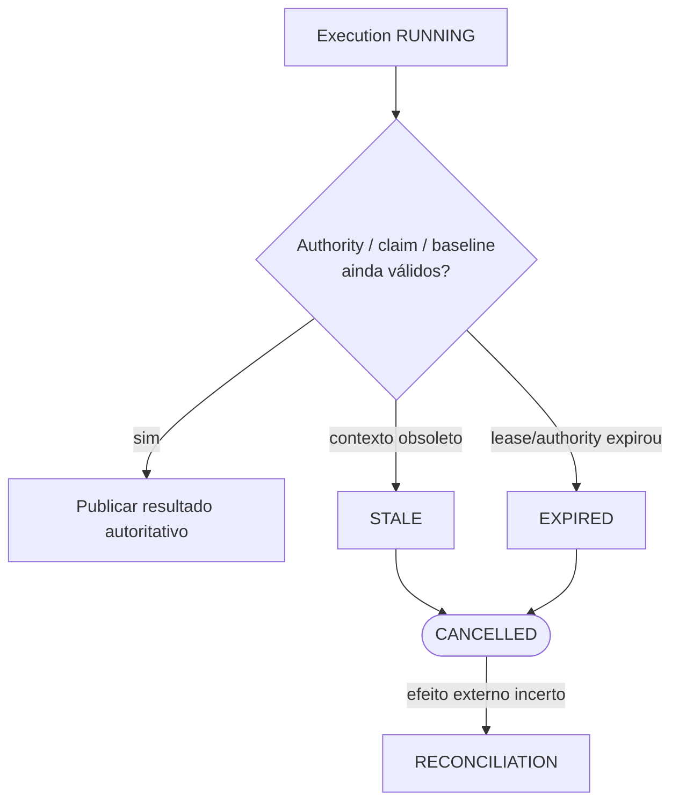
```mermaid
flowchart TD
    RUN[Execution RUNNING]
    AUTH{Authority / claim / baseline<br/>ainda válidos?}
    PUB[Publicar resultado autoritativo]
    STALE[STALE]
    EXP[EXPIRED]
    CANCEL([CANCELLED])
    RECON[RECONCILIATION]

    RUN --> AUTH
    AUTH -->|sim| PUB
    AUTH -->|contexto obsoleto| STALE
    AUTH -->|lease/authority expirou| EXP
    STALE --> CANCEL
    EXP --> CANCEL
    CANCEL -->|efeito externo incerto| RECON
```

Regras centrais:

```text
FAILED não ressuscita.
STALE não publica.
EXPIRED não recupera authority retroativamente.
Resultado tardio é evidência histórica até reconciliation.
```

---

# 8. Como as entidades se encaixam

Fonte normativa: `../01_LIFECYCLE_MODEL.md` e `../../contracts/02_HANDOFF_CONTRACT.md`.

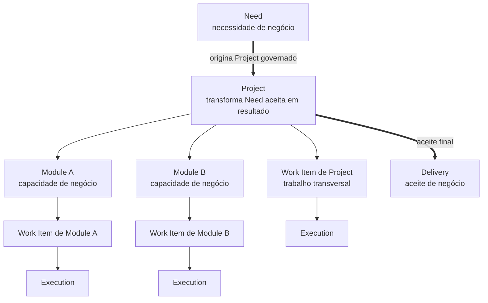
```mermaid
flowchart TD
    N[Need<br/>necessidade de negócio]
    P[Project<br/>transforma Need aceita em resultado]
    M1[Module A<br/>capacidade de negócio]
    M2[Module B<br/>capacidade de negócio]
    WIP[Work Item de Project<br/>trabalho transversal]
    WIM1[Work Item de Module A]
    WIM2[Work Item de Module B]
    E1[Execution]
    E2[Execution]
    E3[Execution]
    D[Delivery<br/>aceite de negócio]

    N ==>|origina Project governado| P
    P --> M1
    P --> M2
    P --> WIP
    M1 --> WIM1
    M2 --> WIM2
    WIP --> E1
    WIM1 --> E2
    WIM2 --> E3
    P ==>|aceite final| D
```

Leis de ownership:

```text
Project nasce de exatamente uma Need ACCEPTED.
Module pertence a exatamente um Project.
Work Item pertence a exatamente um owner: Project OU Module.
Execution pertence a exatamente uma Work Item.
Delivery nasce somente após aceite positivo da candidatura Project.DELIVERY.
```

---

# 9. Gates e decisões humanas

Fonte normativa: `../../governance/03_GATE_POLICY.md`.

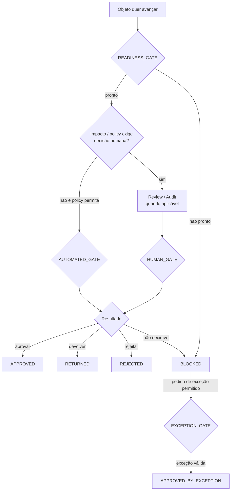
```mermaid
flowchart TD
    OBJ[Objeto quer avançar]
    RG{READINESS_GATE}
    IMP{Impacto / policy exige<br/>decisão humana?}
    REVIEW[Review / Audit<br/>quando aplicável]
    HG{HUMAN_GATE}
    AG{AUTOMATED_GATE}
    RESULT{Resultado}
    APP[APPROVED]
    RET[RETURNED]
    REJ[REJECTED]
    BLK[BLOCKED]
    EXG{EXCEPTION_GATE}
    EXA[APPROVED_BY_EXCEPTION]

    OBJ --> RG
    RG -->|não pronto| BLK
    RG -->|pronto| IMP

    IMP -->|sim| REVIEW
    REVIEW --> HG
    IMP -->|não e policy permite| AG

    HG --> RESULT
    AG --> RESULT

    RESULT -->|aprovar| APP
    RESULT -->|devolver| RET
    RESULT -->|rejeitar| REJ
    RESULT -->|não decidível| BLK
    BLK -->|pedido de exceção permitido| EXG
    EXG -->|exceção válida| EXA
```

Gates humanos esperados por padrão:

```text
Need commitment MATERIAL/CRÍTICA
Product/Conception material
Architecture MATERIAL/CRÍTICA
Plan MATERIAL/CRÍTICA
Risk acceptance material
Exception
Pause
Cancel
Delivery acceptance
Normative ratification
```

`APPROVED_BY_EXCEPTION` é diferente de `APPROVED`.

---

# 10. Continuity, Failure, Recovery e Reconciliation

Fonte normativa: `../../contracts/04_CONTINUITY_AND_RECOVERY_CONTRACT.md`.

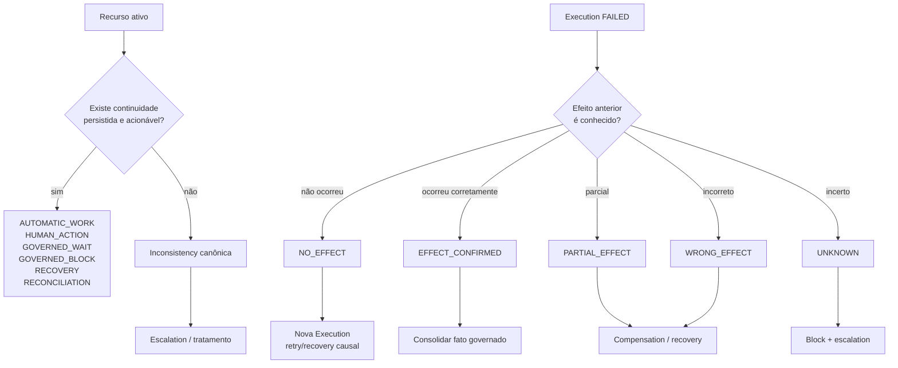
```mermaid
flowchart TD
    ACTIVE[Recurso ativo]
    CONT{Existe continuidade<br/>persistida e acionável?}
    TYPES[AUTOMATIC_WORK<br/>HUMAN_ACTION<br/>GOVERNED_WAIT<br/>GOVERNED_BLOCK<br/>RECOVERY<br/>RECONCILIATION]
    INC[Inconsistency canônica]
    ESC[Escalation / tratamento]
    FAIL[Execution FAILED]
    EFFECT{Efeito anterior<br/>é conhecido?}
    NO[NO_EFFECT]
    YES[EFFECT_CONFIRMED]
    PART[PARTIAL_EFFECT]
    WRONG[WRONG_EFFECT]
    UNK[UNKNOWN]
    RETRY[Nova Execution<br/>retry/recovery causal]
    CONS[Consolidar fato governado]
    COMP[Compensation / recovery]
    BLOCK[Block + escalation]

    ACTIVE --> CONT
    CONT -->|sim| TYPES
    CONT -->|não| INC
    INC --> ESC

    FAIL --> EFFECT
    EFFECT -->|não ocorreu| NO
    EFFECT -->|ocorreu corretamente| YES
    EFFECT -->|parcial| PART
    EFFECT -->|incorreto| WRONG
    EFFECT -->|incerto| UNK

    NO --> RETRY
    YES --> CONS
    PART --> COMP
    WRONG --> COMP
    UNK --> BLOCK
```

Regra de ouro:

```text
efeito incerto
    ↓
RECONCILIATION
    ↓
só depois decidir retry, recovery, consolidation ou compensation
```

Não existe retry cego quando repetição puder duplicar efeito prejudicial.

---

# 11. Mudança de baseline, validade e supersessão

Fonte normativa: `../../state/04_BASELINE_AND_SUPERSESSION_MODEL.md`.

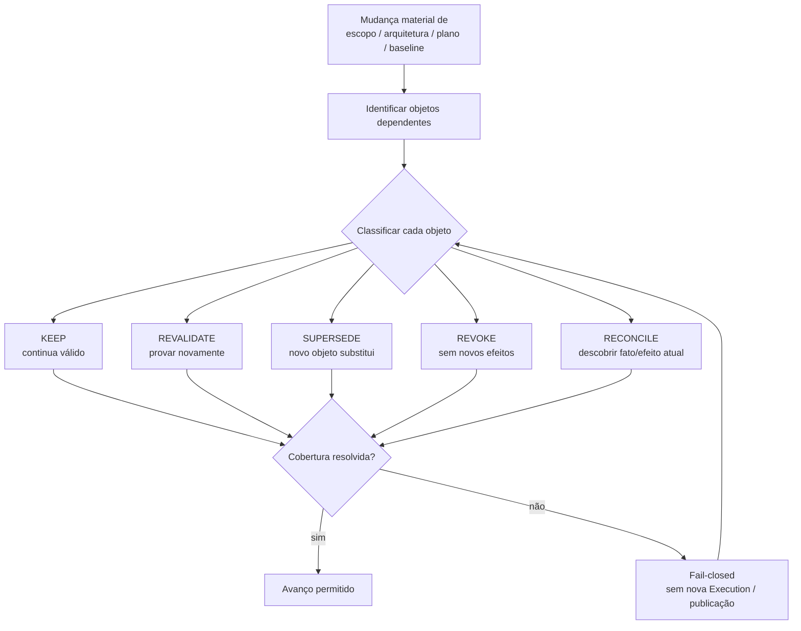
```mermaid
flowchart TD
    CHANGE[Mudança material de<br/>escopo / arquitetura / plano / baseline]
    AFFECT[Identificar objetos dependentes]
    CLASS{Classificar cada objeto}
    KEEP[KEEP<br/>continua válido]
    REVAL[REVALIDATE<br/>provar novamente]
    SUPER[SUPERSEDE<br/>novo objeto substitui]
    REVOKE[REVOKE<br/>sem novos efeitos]
    RECON[RECONCILE<br/>descobrir fato/efeito atual]
    OPEN{Cobertura resolvida?}
    ADV[Avanço permitido]
    STOP[Fail-closed<br/>sem nova Execution / publicação]

    CHANGE --> AFFECT
    AFFECT --> CLASS

    CLASS --> KEEP
    CLASS --> REVAL
    CLASS --> SUPER
    CLASS --> REVOKE
    CLASS --> RECON

    KEEP --> OPEN
    REVAL --> OPEN
    SUPER --> OPEN
    REVOKE --> OPEN
    RECON --> OPEN

    OPEN -->|sim| ADV
    OPEN -->|não| STOP
    STOP --> CLASS
```

A mudança pode afetar:

```text
Modules
Work Items
Executions
evidências
reviews
auditorias
authorities
handoffs
risks
baselines de integração
```

Terminal não é reaberto:

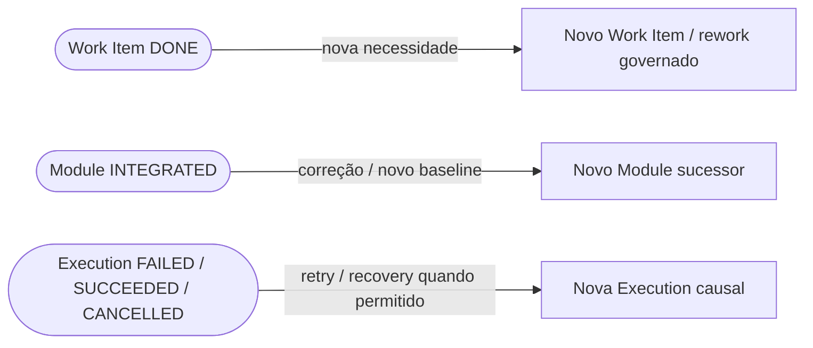
```mermaid
flowchart LR
    WI([Work Item DONE])
    MOD([Module INTEGRATED])
    EX([Execution FAILED / SUCCEEDED / CANCELLED])
    NEW_WI[Novo Work Item / rework governado]
    NEW_MOD[Novo Module sucessor]
    NEW_EX[Nova Execution causal]

    WI -->|nova necessidade| NEW_WI
    MOD -->|correção / novo baseline| NEW_MOD
    EX -->|retry / recovery quando permitido| NEW_EX
```

Migração de **Normative Baseline** também é explícita:

```text
source normative_baseline_ref
        ↓
decisão de migração
        ↓
KEEP / REVALIDATE / SUPERSEDE / REVOKE / RECONCILE
        ↓
target normative_baseline_ref
```

Ratificar norma nova não migra instâncias ativas automaticamente.

---

# 12. Handoff ponta a ponta

Fonte normativa: `../../contracts/02_HANDOFF_CONTRACT.md`.

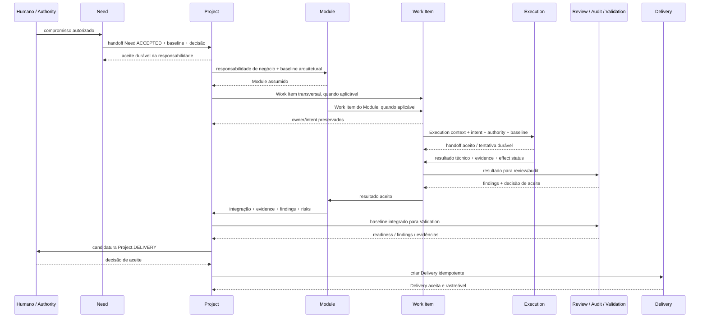
```mermaid
sequenceDiagram
    participant H as Humano / Authority
    participant N as Need
    participant P as Project
    participant M as Module
    participant W as Work Item
    participant E as Execution
    participant V as Review / Audit / Validation
    participant D as Delivery

    H->>N: compromisso autorizado
    N->>P: handoff Need ACCEPTED + baseline + decisão
    P-->>N: aceite durável da responsabilidade

    P->>M: responsabilidade de negócio + baseline arquitetural
    M-->>P: Module assumido

    P->>W: Work Item transversal, quando aplicável
    M->>W: Work Item do Module, quando aplicável
    W-->>P: owner/intent preservados

    W->>E: Execution context + intent + authority + baseline
    E-->>W: handoff aceito / tentativa durável
    E->>W: resultado técnico + evidence + effect status

    W->>V: resultado para review/audit
    V-->>W: findings + decisão de aceite
    W->>M: resultado aceito

    M->>P: integração + evidence + findings + risks
    P->>V: baseline integrado para Validation
    V-->>P: readiness / findings / evidências

    P->>H: candidatura Project.DELIVERY
    H-->>P: decisão de aceite
    P->>D: criar Delivery idempotente
    D-->>P: Delivery aceita e rastreável
```

Regra fundamental do handoff:

```text
"enviei" ≠ "o destino assumiu"
```

O handoff só termina quando:

```text
o destino aceita explicitamente
OU
a responsabilidade fica duravelmente retomável pelo destino correto
```

---

# 13. Caminho visual de uma falha real

Este diagrama junta Work Item, Execution, continuity e recovery em um exemplo operacional.

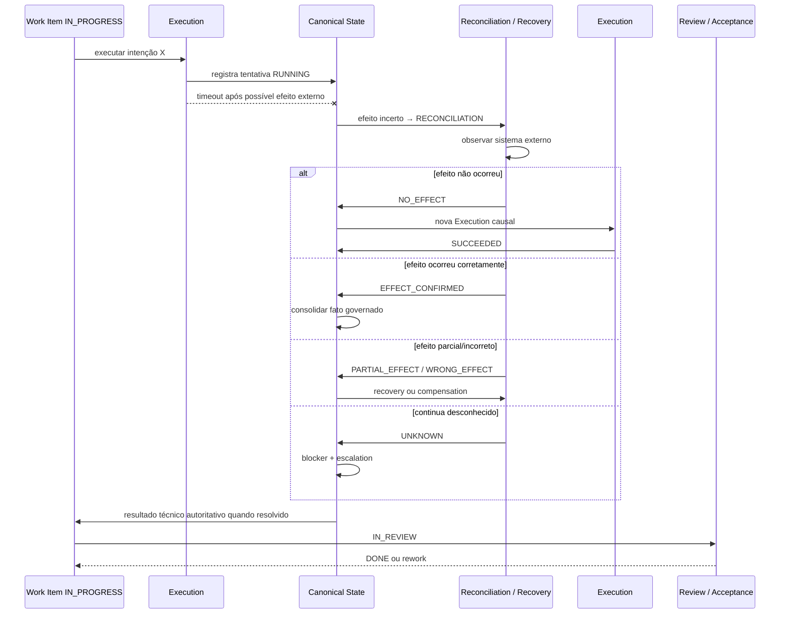
```mermaid
sequenceDiagram
    participant W as Work Item IN_PROGRESS
    participant E1 as Execution #1
    participant C as Canonical State
    participant R as Reconciliation / Recovery
    participant E2 as Execution #2
    participant A as Review / Acceptance

    W->>E1: executar intenção X
    E1->>C: registra tentativa RUNNING
    E1--xC: timeout após possível efeito externo
    C->>R: efeito incerto → RECONCILIATION

    R->>R: observar sistema externo

    alt efeito não ocorreu
        R->>C: NO_EFFECT
        C->>E2: nova Execution causal
        E2->>C: SUCCEEDED
    else efeito ocorreu corretamente
        R->>C: EFFECT_CONFIRMED
        C->>C: consolidar fato governado
    else efeito parcial/incorreto
        R->>C: PARTIAL_EFFECT / WRONG_EFFECT
        C->>R: recovery ou compensation
    else continua desconhecido
        R->>C: UNKNOWN
        C->>C: blocker + escalation
    end

    C->>W: resultado técnico autoritativo quando resolvido
    W->>A: IN_REVIEW
    A-->>W: DONE ou rework
```

---

# 14. Caminho visual de evolução depois de Delivery

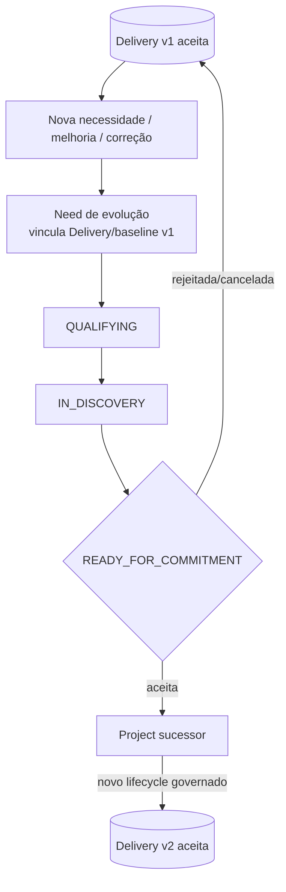
```mermaid
flowchart TD
    D1[(Delivery v1 aceita)]
    CHANGE[Nova necessidade / melhoria / correção]
    EN[Need de evolução<br/>vincula Delivery/baseline v1]
    Q[QUALIFYING]
    DISC[IN_DISCOVERY]
    COM{READY_FOR_COMMITMENT}
    P2[Project sucessor]
    D2[(Delivery v2 aceita)]

    D1 --> CHANGE
    CHANGE --> EN
    EN --> Q
    Q --> DISC
    DISC --> COM
    COM -->|aceita| P2
    P2 -->|novo lifecycle governado| D2
    COM -->|rejeitada/cancelada| D1
```

A Delivery anterior permanece histórica. Evolução não reabre silenciosamente o
Project `DELIVERED`.

---

# 15. Resumo de uma tela

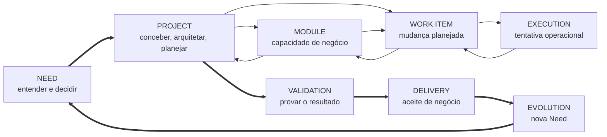
```mermaid
flowchart LR
    N[NEED<br/>entender e decidir]
    P[PROJECT<br/>conceber, arquitetar, planejar]
    M[MODULE<br/>capacidade de negócio]
    W[WORK ITEM<br/>mudança planejada]
    E[EXECUTION<br/>tentativa operacional]
    V[VALIDATION<br/>provar o resultado]
    D[DELIVERY<br/>aceite de negócio]
    EV[EVOLUTION<br/>nova Need]

    N ==> P
    P --> M
    P --> W
    M --> W
    W --> E
    E --> W
    W --> M
    M --> P
    P ==> V
    V ==> D
    D ==> EV
    EV ==> N
```

Frase operacional:

```text
Need diz por que mudar.
Project governa o compromisso.
Module organiza capacidades de negócio.
Work Item define o que precisa mudar.
Execution tenta executar.
Validation prova.
Delivery aceita.
Evolution começa de novo por Need.
```

---

# 16. Limite de autoridade deste guia

Este guia:

- pode ser usado para onboarding;
- pode ser usado para navegação;
- pode apoiar implementação e auditoria;
- pode ser atualizado quando os documentos normativos mudarem;
- não autoriza transição;
- não cria estado;
- não substitui gate;
- não altera baseline;
- não resolve conflito normativo.

Se um diagrama parecer permitir algo que a norma textual proíbe:

```text
a norma textual prevalece
```
