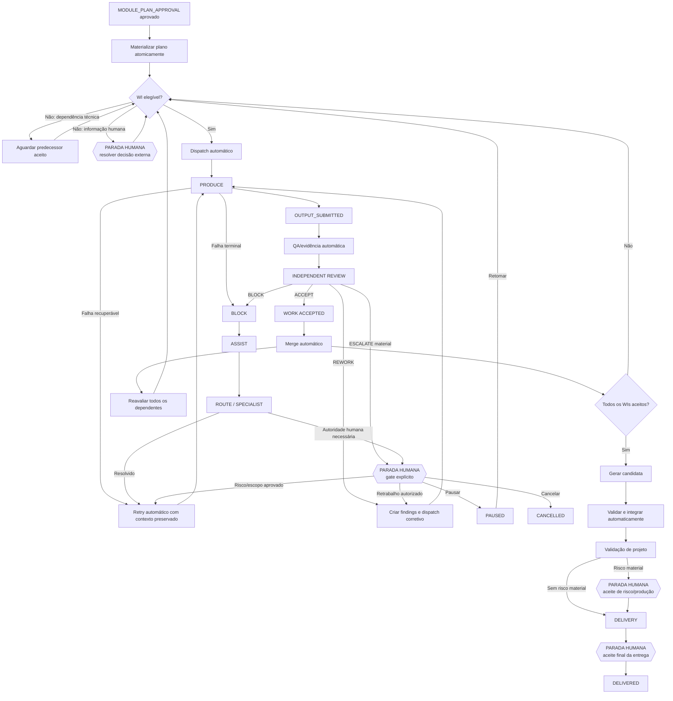

# Auditoria de Aderência do Lifecycle

**Data:** 2026-08-22
**Branch auditada:** `phase6-development`
**HEAD auditado:** `91a269c7b3da788d3d60c1a57e0898ebecefc7b9`
**Tipo:** Auditoria arquitetural e funcional
**Status:** Baseline de correção
**Implementação realizada durante a auditoria:** Não

> Este documento registra a baseline de não conformidades identificadas
> entre o lifecycle normativo do NAAMIVE e sua implementação no runtime,
> APIs, persistência e UI. Deve ser preservado como evidência histórica
> mesmo após as correções.

# Relatório de auditoria de aderência

## 1. Resumo executivo

Conclusão: a implementação atual **não representa corretamente o modelo operacional normativo do NAAMIVE**.

O sistema possui partes robustas — jobs com lease/retry, evidências, idempotência, planejamento autônomo, QA determinística e o micro-lifecycle F6 isolado — mas a jornada real ainda é predominantemente uma sequência de comandos operacionais manuais.

Os desvios mais graves são:

- `MODULE_PLAN_APPROVAL` materializa work items em `WAITING_FOR_WORK_ITEM_AUTHORIZATION`, criando uma aprovação humana individual não prevista.
- Não existe scheduler que despache automaticamente work items elegíveis.
- Desenvolvimento concluído para em `QA_IN_PROGRESS`; QA não é agendada pelo worker e a UI atual não oferece a ação correta.
- F6 não supervisiona `DEVELOP_WORK_ITEM` nem `PLAN_MODULE_WORK_ITEMS`; no projeto real não existe nenhum `work_acceptance`.
- Retrabalho com evidência pode ficar sem saída na UI, porque ela chama `restart-development`, que rejeita tentativas com evidência.
- Merge, criação/validação de candidata e integração dependem de chamadas HTTP/cliques, embora sejam controles técnicos.
- Projeto e módulo não avançam pelo macro-lifecycle normativo até `VALIDATION`, `DELIVERY` e `DELIVERED`.
- Não existe aceite final de entrega no runtime.
- `PAUSED` e `CANCELLED` normativos não estão implementados no workflow web; arquivamento é usado com semântica diferente.
- Vários comandos sensíveis ordinários não possuem autorização real; em F6, papéis são informados por headers sem autenticação demonstrada.

A auditoria foi realizada em:

- branch: `phase6-development`
- HEAD: `91a269c7b3da788d3d60c1a57e0898ebecefc7b9`
- working tree inicial e final: limpa
- arquivos modificados: nenhum
- testes executados: nenhum, para preservar o banco/projeto real durante a auditoria observacional
- validações executadas: inspeção integral dos documentos solicitados, rastreamento estático, consultas SQL somente leitura, `git status`, `git diff --check` e `git diff --stat`.

---

## 2. Lifecycle esperado

As máquinas normativas estabelecem controles objetivos: evidência automatizada e revisão independente podem autorizar avanço sem humano; decisão humana é reservada a negócio, risco material e exceção. Isso está explícito na [política de gates](/home/mhj/git/naamive/naamive/governance/GATE_POLICY.md:3), no [lifecycle de projeto](/home/mhj/git/naamive/naamive/orchestration/PROJECT_LIFECYCLE.md:23) e no [lifecycle de módulo](/home/mhj/git/naamive/naamive/orchestration/MODULE_LIFECYCLE.md:22).

| Estado/evento | Controle | Ação esperada | Próximo estado |
|---|---|---|---|
| Intake validado | `REGISTER_PROJECT`, gate humano | Aprovar, rejeitar ou pedir correção | `ANALYSIS` ou retorno |
| Projeto registrado | Automático | Despachar análise | `ANALYSIS` |
| Análise produzida | Revisão independente automática | Revisar evidências | `DEFINITION` ou rework |
| Definição concluída | `PRODUCT_COMMITMENT`, gate humano | Assumir escopo, investimento e riscos | `ARCHITECTURE` ou rework |
| Arquitetura produzida | Revisão independente; humano somente se material | Aceitar automaticamente ou abrir gate condicional | `PLANNING` |
| Plano de módulo produzido | `MODULE_PLAN_APPROVAL` | Aprovar o plano inteiro ou solicitar ajustes | `WORK_ITEMS_ACTIVE` |
| Plano aprovado | Automático | Materializar e despachar todos os WIs elegíveis | `IMPLEMENTING` |
| WI executado | Evidência automatizada | `OUTPUT_SUBMITTED`, QA e review | `INDEPENDENT_REVIEW` |
| Review `ACCEPT` | Automático | Aceitar, integrar e reavaliar dependentes | Próximo WI/fase |
| Review `REWORK` | Automático até limite/política | Criar finding e dispatch corretivo | `PRODUCE → REVIEW` |
| Review `BLOCK` | Assistência e routing | Diagnosticar, rotear especialista, resolver/retry | Novo dispatch ou escalada |
| Falha recuperável | Retry/restart automático ou operação assistida | Preservar contexto e reexecutar | Estado ativo correspondente |
| Integração concluída | Evidência/revisão automática | Avançar módulo e projeto | `VALIDATION` |
| Validação suficiente | Revisão; humano somente por risco material | Preparar entrega | `DELIVERY` |
| Entrega pronta | Aceite final humano | Aprovar entrega/handover | `DELIVERED` |
| Pausa/cancelamento | Decisão humana registrada | Pausar, retomar ou cancelar | Estado anterior/`CANCELLED` |

O micro-lifecycle universal esperado é:

`DISPATCH → PRODUCE → OUTPUT_SUBMITTED → INDEPENDENT_REVIEW → ACCEPT`

com ramos:

- `REWORK → PRODUCE → OUTPUT_SUBMITTED → REVIEW`;
- `BLOCK → ASSIST → ROUTE → SPECIALIST → RETRY`;
- `ESCALATE` somente por autoridade humana necessária ou automação esgotada.

O próprio compass registra que apenas `ACCEPT` caracteriza conclusão e que `EXECUTION_SUCCEEDED != WORK_ACCEPTED` em [LIFECYCLE_COMPASS.md](/home/mhj/git/naamive/naamive/orchestration/LIFECYCLE_COMPASS.md:145).

---

## 3. Lifecycle atualmente implementado

A jornada web efetiva é:

1. Humano aprova registro.
2. Projeto fica `REGISTERED`.
3. Humano clica “Iniciar descoberta”.
4. Agentes executam análise, requisitos e review.
5. Humano decide `PRODUCT_COMMITMENT`.
6. Baseline tecnológica passa por outro gate obrigatório.
7. Humano materializa módulo.
8. Humano aprova o módulo.
9. Definição do módulo é enviada por comando/formulário.
10. Humano aprova arquitetura, sempre.
11. Agente produz plano.
12. Humano aprova `MODULE_PLAN_APPROVAL`.
13. Cada WI nasce em `WAITING_FOR_WORK_ITEM_AUTHORIZATION`.
14. Humano clica “Autorizar desenvolvimento”.
15. Worker executa desenvolvimento.
16. A execução para em `QA_IN_PROGRESS`.
17. Alguém precisa chamar `/qa`.
18. Depois precisa chamar `/merge`.
19. Depois criar candidata, validar e integrar por comandos separados.
20. Projeto e módulo não avançam até os estados normativos de entrega.

A persistência ainda publica explicitamente a transição humana individual:

- default do WI em [016_phase_3_module_delivery.sql](/home/mhj/git/naamive/naamive/runtime/node-web/migrations/016_phase_3_module_delivery.sql:15);
- `AUTHORIZE_WORK_ITEM`, autoridade `OPERATOR`, em [017_phase_3_published_transitions.sql](/home/mhj/git/naamive/naamive/runtime/node-web/migrations/017_phase_3_published_transitions.sql:7).

Já a decisão posterior F5-22 exige exatamente o oposto: agendamento automático dos elegíveis e ausência de autorização humana por item em [F5-22](/home/mhj/git/naamive/naamive/orchestration/demand-intake/node-web-orchestration-platform/phase-5-implementation-tasks/F5-22-autonomous-module-planning.md:38).

---

## 4. Principais diferenças

| Planejado | Implementado | Por que diverge |
|---|---|---|
| Registro autoriza descoberta | Existe clique adicional “Iniciar descoberta” | Estado técnico virou operação humana |
| Módulos candidatos já foram assumidos no `PRODUCT_COMMITMENT` | Cada módulo recebe `MODULE_APPROVAL` obrigatório | Gate de negócio duplicado |
| Arquitetura avança por revisão independente, salvo materialidade | `ARCHITECTURE_DECISION` é sempre humano | Não existe avaliação de materialidade |
| Plano aprovado autoriza conjunto | Cada WI aguarda autorização individual | Violação direta do contrato F5 |
| Elegibilidade provoca dispatch | Não existe scheduler | API `startDevelopment` é a única entrada |
| Produção provoca QA/review | Worker encerra job e deixa `next_action=SUBMIT_QA` | QA depende de comando externo |
| F6 supervisiona trabalho delegado selecionado | Só alcança três jobs de discovery | Desenvolvimento real contorna F6 |
| `REWORK` reentra no ciclo automaticamente | Exige comandos com payload técnico e novo start | Retrabalho não é orquestrado |
| Dependência satisfeita desbloqueia próximo WI | `startDevelopment` apenas rejeita dependência incompleta | Nenhum componente observa desbloqueio |
| Integração técnica é automatizada | Merge/candidata/validação/integração são endpoints manuais | UI opera o workflow |
| Projeto/módulo avançam juntos | Projeto fica `READY_FOR_MODULE_MATERIALIZATION` | Macro-lifecycle não é sincronizado |
| Entrega termina em aceite humano | Não existe fluxo final de entrega | Lifecycle web é incompleto |

---

## 5. Análise dos quatro problemas conhecidos

### 5.1 Recuperação, retry e restart

| Situação | Entrada | Saída/API | UI | Preservação/novo dispatch | Resultado |
|---|---|---|---|---|---|
| Discovery `FAILED` | Falha terminal de agente | `retry-discovery` | “Tentar novamente” | Preserva revisão e cria operação/job | Aderência parcial |
| Planejamento de módulo falha | Retries automáticos esgotados | `retry-plan` com operação de origem | Botão específico | Preserva snapshot e lineage | Aderente |
| Falha transitória de desenvolvimento | `failJob` não permanente | Job vira `RETRYABLE` | Mostra telemetria | Reutiliza reserva reconciliada | Aderência parcial |
| Falha terminal de desenvolvimento sem evidência | Job `FAILED`, WI `REWORK_ELIGIBLE` | `retry-development` ou `restart-development` | UI chama somente restart | Restart cria nova tentativa | Parcial |
| Falha/rework com evidência | QA/review produziu head, commits/findings | `/rework` exige delivery, SHA e findings | UI não produz payload válido; painel chama restart | Restart rejeita evidência | **Limbo crítico** |
| `WAITING_FOR_ESCALATION` | Limite de rework ou worktree divergente | `rework-decision` existe | Gate não é projetado/renderizado | Saída existe apenas por API oculta | **Limbo crítico** |
| Reviewer F6 falha permanentemente | Job `REVIEW` esgota retry | Acceptance volta a `WAITING_FOR_INDEPENDENT_REVIEWER` | Sem ação operacional suficiente | Não abre novo `work_block` nesse caminho | **Limbo crítico** |
| Block F6 resolvido | Transição `RESOLVED` | Reenfileira job/operação | UI para On-call Owner | Contexto original preservado | Aderente |
| Integração bloqueada | Defeito, transiente ou divergência Git | APIs de revalidate/retry/reconcile/supersede | UI genérica/incompleta | Algumas saídas preservam tentativa | Parcial |

O worker implementa retry automático, mas também devolve uma tentativa transitória ao estado semanticamente humano `WAITING_FOR_WORK_ITEM_AUTHORIZATION` em [worker.ts](/home/mhj/git/naamive/naamive/runtime/node-web/src/worker.ts:76).

A recuperação robusta `retryDevelopmentWorkItem` existe, mas a UI usa `restart-development`; este último rejeita qualquer tentativa que já possua evidência, conforme [phase3.ts](/home/mhj/git/naamive/naamive/runtime/node-web/src/phase3.ts:176) e [index.html](/home/mhj/git/naamive/naamive/runtime/node-web/web/index.html:214).

### 5.2 Gates sem ação ou gates incorretos

- `REGISTER_PROJECT`: API e UI existem.
- `PRODUCT_COMMITMENT`: API e UI existem, embora `REWORK_REQUIRED` esteja representado de forma indireta como rejeição/ajuste.
- `MODULE_PLAN_APPROVAL`: API e UI existem, com aprovação ou ajustes.
- Aceite final da entrega: inexistente.
- Pausa/cancelamento normativos: inexistentes no workflow web.
- Gates condicionais F6: API genérica existe; UI cobre principalmente fechamento escalado.
- Rework escalado: API existe, mas não há projeção/UI correspondente.
- `MODULE_APPROVAL`: existe e é sempre humano, mas não está entre os gates normativos legítimos após o compromisso de produto.
- `ARCHITECTURE_DECISION`: sempre humano, embora a norma só exija humano diante de decisão material.
- Baseline tecnológica: sempre humana; deveria ser condicional à materialidade/autoridade necessária, não automaticamente um gate universal.

### 5.3 `WAITING_FOR_WORK_ITEM_AUTHORIZATION`

Origem:

- introduzido no planejamento Fase 3;
- persistido como default em migration 016;
- publicado como transição `OPERATOR` em migration 017;
- reforçado pelo E2E, que exige esse estado em [phase3.e2e.test.ts](/home/mhj/git/naamive/naamive/runtime/node-web/src/phase3.e2e.test.ts:69).

Superveniência normativa:

- F5-22 determina que o plano seja aprovado uma única vez;
- F5-22 determina agendamento automático dos elegíveis;
- F5-23 declara que decomposição é requisito de qualidade, “não uma autorização humana adicional”, em [F5-23](/home/mhj/git/naamive/naamive/orchestration/demand-intake/node-web-orchestration-platform/phase-5-implementation-tasks/F5-23-autonomous-plan-decomposition.md:16).

Comportamento real:

- `approveModulePlan` insere WIs sem informar estado, herdando o default legado;
- não cria delivery/job;
- não chama scheduler;
- `startDevelopment` só é chamado por endpoint HTTP;
- a UI diz “Autorize o desenvolvimento de cada item” e oferece botão individual em [index.html](/home/mhj/git/naamive/naamive/runtime/node-web/web/index.html:123).

Classificação: **violação de lifecycle, severidade ALTA**. Para WIs elegíveis sem outro bloqueio, o estado deve representar fila/elegibilidade automática, não autorização humana.

### 5.4 QA e assurance interrompendo automação

O worker finaliza desenvolvimento assim:

- delivery → `EVIDENCE_REVIEW`;
- WI → `QA_IN_PROGRESS`;
- evento → `next_action: SUBMIT_QA`.

Isso ocorre em [phase3.ts](/home/mhj/git/naamive/naamive/runtime/node-web/src/phase3.ts:301).

Entretanto:

- nenhum job de QA é criado;
- o worker encerra o job de desenvolvimento como `COMPLETED`;
- `/qa` é um POST externo síncrono;
- a projeção de `QA_IN_PROGRESS` informa apenas “Acompanhar a execução em andamento”, embora nenhuma execução esteja ocorrendo, em [projection.ts](/home/mhj/git/naamive/naamive/runtime/node-web/src/projection.ts:16);
- o renderer atual de work items só apresenta ação para `WAITING_FOR_WORK_ITEM_AUTHORIZATION`;
- o botão antigo “Executar QA” verifica incorretamente `DEVELOPMENT_IN_PROGRESS`, não `QA_IN_PROGRESS`, em [index.html](/home/mhj/git/naamive/naamive/runtime/node-web/web/index.html:24).

F6 implementa seleção e dispatch automático de reviewer em [assurance.ts](/home/mhj/git/naamive/naamive/runtime/node-web/src/assurance.ts:264), mas `AgentExecutionService` só atende:

- `ANALYZE_PRODUCT_NEED`;
- `DEFINE_PRODUCT_REQUIREMENTS`;
- `REVIEW_PRODUCT_COMMITMENT`.

Isso é explícito em [agent-execution-service.ts](/home/mhj/git/naamive/naamive/runtime/node-web/src/agent-execution-service.ts:17). `DEVELOP_WORK_ITEM` segue um caminho especial no worker e nunca cria acceptance.

Classificação: **CRÍTICA** no comportamento real, pois a produção terminou, a ação normativa seguinte é automatizável e não existe saída na UI atual.

---

## 6. Outros problemas descobertos

1. **Macro-lifecycle incompleto.** O banco publica `MODULE_COMPLETED`, mas não há transição até ele. Não existem estados equivalentes a `INTEGRATING`, `VALIDATING`, `READY_FOR_DELIVERY` e `DELIVERED` no workflow web do módulo.

2. **Projeto não acompanha execução.** O caso real permanece `READY_FOR_MODULE_MATERIALIZATION` enquanto há desenvolvimento e QA em andamento.

3. **Aceite final inexistente.** Não há workflow, gate, API ou UI de `DELIVERY → DELIVERED`.

4. **Início da descoberta manual.** Após aprovação de registro, um clique adicional cria o job de análise em [service.ts](/home/mhj/git/naamive/naamive/runtime/node-web/src/service.ts:96).

5. **Materialização de módulo manual.** A UI originalmente pede ao usuário que redigite objetivo, escopo, dependências e critérios, em vez de materializar os módulos candidatos aprovados.

6. **Gate de módulo duplicado.** `PRODUCT_COMMITMENT` já assumiu os módulos candidatos, mas `materializeModule` abre `MODULE_APPROVAL` incondicional em [phase3.ts](/home/mhj/git/naamive/naamive/runtime/node-web/src/phase3.ts:32).

7. **Arquitetura sempre humana.** A norma exige humano somente para decisão material, mas o runtime sempre abre `ARCHITECTURE_DECISION`.

8. **Integração operada por UI.** Merge, candidata, validação e integração são endpoints separados em [server.ts](/home/mhj/git/naamive/naamive/runtime/node-web/src/server.ts:176), sem encadeamento automático.

9. **F6 é opt-in sem política operacional.** O banco possui apenas políticas geradas por testes, todas específicas de `ANALYZE_PRODUCT_NEED`. Não existe política aplicada ao projeto real ou ao desenvolvimento.

10. **Reviewer permanentemente indisponível.** A indisponibilidade inicial abre `work_block`, mas falha terminal do job de review apenas altera a acceptance para espera, sem criar/correlacionar um novo block em [worker.ts](/home/mhj/git/naamive/naamive/runtime/node-web/src/worker.ts:83).

11. **Assistência não é autônoma.** Existe API para registrar `assistance_proposal`, mas não foi localizado dispatch automático de assistente/especialista; a UI apenas exibe propostas já existentes.

12. **Múltiplos bloqueios externos são perdidos.** `approveModulePlan` usa um `Map<work_item_id, blocker>` e sobrescreve dependências externas anteriores do mesmo WI. O caso real mostra o efeito: o primeiro WI foi inicialmente bloqueado por mais de uma decisão, mas só uma ficou materializada.

13. **Metadado de bloqueio fica obsoleto.** Ao resolver um bloqueio, `external_blocked=false`, mas `blocked_state='EXTERNAL_BLOCKED'` e justificativas anteriores permanecem no payload.

14. **UI composta por renderers concorrentes.** O arquivo contém sucessivas substituições de `renderProject`, observers e renderers “compat”; a própria F5-22 determinava um único dono de renderização. Isso explica ações antigas, desaparecidas ou inconsistentes.

15. **Autorização de API insuficiente.** Endpoints ordinários de gates, QA, merge e integração não demonstram autenticação/RBAC. F6 verifica papéis em headers, mas esses headers, isoladamente, não constituem identidade autenticada.

16. **Arquivamento não equivale a cancelamento normativo.** A UI chama arquivar de cancelar, mas persiste `ARCHIVED`, falha jobs/operações e não implementa `CANCELLED` preservando o lifecycle normativo.

17. **Conflito documental F6.** O planejamento está marcado `IMPLEMENTATION_COMPLETE_VALIDATED`, mas ainda afirma “não implementa runtime” e “implementação futura” em [15_PHASE_6](/home/mhj/git/naamive/naamive/orchestration/demand-intake/node-web-orchestration-platform/15_PHASE_6_AGENT_SUPERVISION_AND_ASSURANCE.md:3). O protocolo e o compass também ainda descrevem partes como futuras.

18. **Conflito documental F5.** F5-22 permanece `TODO`, embora partes posteriores estejam marcadas como concluídas e a UI declare comportamento que o backend não cumpre.

---

## 7. Matriz de aderência

| Fluxo/Estado | Comportamento normativo | Comportamento atual | Aderente? | Severidade | Correção necessária |
|---|---|---|---|---|---|
| Registro → descoberta | Dispatch automático após gate | Clique “Iniciar descoberta” | Não | ALTA | Encadear job no commit do gate |
| Materialização de módulo | Derivar módulos aprovados | Formulário/comando humano | Não | ALTA | Materialização automática |
| `MODULE_APPROVAL` | Não duplicar compromisso | Gate sempre aberto | Não | ALTA | Remover ou tornar condicional |
| Arquitetura | Review independente; humano se material | Gate sempre humano | Não | ALTA | Avaliar materialidade |
| `MODULE_PLAN_APPROVAL` | Um único gate do conjunto | Aprovação/ajustes existem | Sim | — | Preservar |
| Pós-aprovação do plano | Agendar elegíveis | Apenas insere WIs | Não | CRÍTICA | Scheduler transacional |
| `WAITING_FOR_WORK_ITEM_AUTHORIZATION` | Não deve ser gate individual | Autoridade `OPERATOR` | Não | ALTA | Nova versão do workflow/migração |
| Dependência satisfeita | Reavaliar e despachar | Só validada quando alguém chama start | Não | CRÍTICA | Eventos de elegibilidade |
| Desenvolvimento | Produzir output | Worker executa automaticamente após job | Parcial | MÉDIA | Integrar com scheduler/F6 |
| `EVIDENCE_REVIEW`/`QA_IN_PROGRESS` | QA/review automáticos | Para em POST `/qa` | Não | CRÍTICA | Criar job automático |
| `OUTPUT_SUBMITTED` | Sempre revisar no opt-in | Só discovery F6 | Não | ALTA | Cobrir desenvolvimento/planning |
| Review `ACCEPT` | Avançar automaticamente | Funciona apenas no F6 isolado | Parcial | ALTA | Conectar ao lifecycle real |
| Review `REWORK` | Dispatch corretivo automático | Finding/decisão, mas novo start manual | Não | CRÍTICA | Rework scheduler |
| Review `BLOCK` | Assist/route/retry | Block persiste; assistência não despachada | Parcial | ALTA | Dispatch de assistência/especialista |
| Reviewer terminalmente indisponível | Block explícito e recuperação | Espera sem novo block/ação | Não | CRÍTICA | Reconciliação e fallback |
| `REWORK_ELIGIBLE` | Retomar conforme semântica | UI chama restart incompatível | Não | CRÍTICA | Ações separadas por causa |
| `WAITING_FOR_ESCALATION` | Gate explícito | API oculta, sem projeção/UI | Não | CRÍTICA | Projetar gate e decisões |
| `READY_FOR_PHASE_MERGE` | Integração automática | Comando manual | Não | ALTA | Worker/orquestrador |
| Candidata/validação/integração | Encadeamento técnico | Vários cliques/endpoints | Não | ALTA | Pipeline automático |
| Macro estado do módulo | Implementar → integrar → validar → entregar | Fica `WORK_ITEMS_ACTIVE` | Não | CRÍTICA | Completar máquina |
| Macro estado do projeto | Acompanhar progresso | Fica `READY_FOR_MODULE_MATERIALIZATION` | Não | CRÍTICA | Agregador transacional |
| Aceite de entrega | Gate final humano | Ausente | Não | CRÍTICA | Implementar gate/API/UI |
| `PAUSED`/`CANCELLED` | Trilhos normativos | Ausentes; usa `ARCHIVED` | Não | ALTA | Publicar estados/transições |
| Bloqueio externo | Preenchimento humano explícito | API/UI existem | Parcial | MÉDIA | Suportar múltiplos blockers e auto-dispatch |
| Segurança das ações | Autoridade autenticada | Endpoints abertos/headers declarativos | Não | ALTA | Autenticação e RBAC |
| Documentação F5/F6 | Refletir contrato vigente | Status e linguagem conflitantes | Não | BAIXA | Atualização documental |

---

## 8. Análise do teste real atual

Snapshot somente leitura de 22/08/2026:

- projeto: `728901f8-17fe-4fc9-bdc4-0b2fabc2ce08`
- estado: `READY_FOR_MODULE_MATERIALIZATION`
- workflow: `PROJECT_DISCOVERY v3`
- baseline: revisão 1, `APPROVED`
- módulo: `registro-de-solicitacoes`
- módulo: `WORK_ITEMS_ACTIVE`
- `work_acceptances`: zero
- `MODULE_PLAN_APPROVAL`: aprovado em 12/08/2026.

### WI 1 — Persistência de solicitações e status

- ID: `fcf9e503-5714-4d6d-8a53-32e4974645e0`
- WI: `QA_IN_PROGRESS`
- delivery: `EVIDENCE_REVIEW`
- job: `COMPLETED`
- operation: `SUCCEEDED`
- worktree: `ACTIVE`
- head: `57869e193b886ebfdbe23d2571dd0d7aa6044195`
- último fato relevante: `DEVELOPMENT_EVIDENCE_READY`
- `next_action`: `SUBMIT_QA`.

Por que parou: `finalizeDevelopmentJob` concluiu produção, mas não criou job de QA/reviewer. O orquestrador tratou “output disponível” como fim da execução técnica.

O que deveria acontecer agora:

1. agendar QA automatizada;
2. validar evidências;
3. despachar reviewer independente;
4. em `ACCEPT`, integrar automaticamente o WI;
5. reavaliar dependentes;
6. despachar a métrica automaticamente;
7. manter a interface bloqueada até resolver sua decisão externa.

### WI 2 — Interface de registro e acompanhamento

- ID: `4c556479-1f08-4af0-887c-a574cf226b6d`
- estado: `WAITING_FOR_WORK_ITEM_AUTHORIZATION`
- dependência técnica: `request-record-store`
- bloqueio externo ativo: Gestão de Operações deve validar o grupo prioritário.

Há aqui uma intervenção humana legítima: informar/confirmar o grupo prioritário. A UI possui “Resolver bloqueio externo”, o que é correto.

Mas a autorização individual de desenvolvimento não é legítima. Depois de:

- decisão externa registrada; e
- predecessor aceito/integrado;

o WI deve ser despachado automaticamente.

### WI 3 — Métrica de tempo de primeira resposta

- ID: `813d56f5-3402-4090-8283-d84858486133`
- estado: `WAITING_FOR_WORK_ITEM_AUTHORIZATION`
- dependência: `request-record-store`
- bloqueio externo: nenhum.

Não existe decisão humana pendente. Assim que o primeiro WI for aceito e disponibilizado na fase, este é o **próximo dispatch automático legítimo**.

### Sequência correta para o caso

`WI Persistência → QA automática → review independente → ACCEPT → merge automático`

Depois:

- `WI Métrica` torna-se elegível e é despachado automaticamente;
- `WI Interface` continua parado somente pelo grupo prioritário;
- resolvida essa decisão e satisfeita a dependência, a interface também é despachada automaticamente.

---

## 9. Estados que podem ficar em limbo

| Estado | Significado | Deve parar? | Motivo legítimo | Ação esperada | Ação atual na UI |
|---|---|---:|---|---|---|
| `FAILED` discovery | Agente esgotou retries | Sim | Falha terminal | Tentar novamente | Existe |
| `FAILED` development | Executor falhou | Só após retry automático | Correção técnica necessária | Retry/restart contextual | Parcial e por vezes incorreta |
| `REWORK_REQUIRED` F6 | Review encontrou finding | Não, normalmente | Só escalar por limite/materialidade | Dispatch corretivo | Reconcile manual/indireto |
| `REWORK_ELIGIBLE` | WI pode ser corrigido/reexecutado | Não ou pausa assistida | Finding/falha terminal | Iniciar retrabalho ou retry correto | Chama restart incompatível |
| `WAITING_FOR_GATE` | Decisão humana legítima | Sim | Gate identificado | Decisões do gate | Estado macro não implementado uniformemente |
| `WAITING_FOR_WORK_ITEM_AUTHORIZATION` | Estado legado | Não | Nenhum gate normativo | Dispatch automático | “Autorizar desenvolvimento” |
| `QA_IN_PROGRESS` | QA deve ocorrer | Não | Nenhum | Job de QA/reviewer | Nenhuma ação válida |
| `EVIDENCE_REVIEW` | Evidência pronta | Não | Nenhum | Review automático | Nenhuma |
| `OUTPUT_SUBMITTED` | Saída aguarda review | Não | Reviewer indisponível pode bloquear | Dispatch reviewer/fallback | Só aparece em F6 opt-in |
| `WAITING_FOR_INDEPENDENT_REVIEWER` | Sem reviewer elegível | Sim | Capacidade/independência | Routing, exceção governada ou retry | Incompleta após falha terminal |
| `BLOCKED` F6 | Bloqueio explícito | Sim | Dependência/ambiente/política | Assistir, rotear, resolver, escalar | Transições existem; assistência não |
| `WAITING_FOR_ESCALATION` | Decisão material de rework | Sim | Limite/risco/arquitetura | Gate completo | Ausente |
| `READY_FOR_PHASE_MERGE` | QA passou | Não | Nenhum | Merge automático | Renderer atual não oferece ação confiável |
| `INTEGRATION_BLOCKED` | Integração interrompida | Sim | Defeito/divergência/transiente | Ação específica por causa | Ações genéricas/parciais |
| `PAUSED` | Pausa humana | Sim | Decisão registrada | Retomar/cancelar | Não existe no macro runtime |
| `CANCELLED` | Cancelamento terminal preservado | Sim | Decisão humana | Nenhuma/consulta histórica | Não existe no macro runtime |
| `WORK_ITEMS_ACTIVE` após integração | Módulo deveria avançar | Não | Nenhum | Atualizar macro estado | Não existe transição |

---

## 10. Gates humanos legítimos

| Gate | Momento | Autoridade | Decisões | Estado de espera | API/UI atual |
|---|---|---|---|---|---|
| `REGISTER_PROJECT` | Intake validado | Autoridade de negócio/intake | Aprovar, rejeitar/rework | `WAITING_FOR_REGISTRATION` | Existe |
| `PRODUCT_COMMITMENT` | Definição de produto pronta | Dono de produto/negócio | Aprovar, solicitar ajustes, rejeitar | `WAITING_FOR_PRODUCT_COMMITMENT` | Existe parcialmente |
| `MODULE_PLAN_APPROVAL` | Plano completo do módulo | Autoridade do módulo/produto | Aprovar conjunto ou solicitar ajustes | Gate aberto do plano | Existe e deve ser preservado |
| Aceite final de entrega | Release/handover pronto | Dono do negócio | Aprovar, rejeitar/rework | `DELIVERY` | Ausente |
| Arquitetura material | Somente quando materialidade detectada | Tech lead/repository owner | Aprovar, pedir ajuste, rejeitar | Gate condicional | Atualmente sempre obrigatório |
| Risco residual/produção de alto risco | Validação/entrega | Autoridade de risco/operação | Aceitar risco, rejeitar, rework | Gate condicional | Parcial F6 |
| Segurança/compliance/dados/fornecedor | Quando regra exigir | Autoridade especializada | Conforme política | Gate condicional | Não há jornada completa |
| Exceção de independência | Reviewer sem separação padrão | Tech lead/repository owner | Aprovar/rejeitar com expiração | F6 reviewer wait | API existe; UI incompleta |
| Fechamento escalado | Block escalado | Tech lead/repository owner | Aprovar/rejeitar | F6 `ESCALATED` | API/UI existem |
| Pausa/cancelamento | Qualquer estado ativo | Pessoa autorizada | Pausar, retomar, cancelar | `PAUSED` | Ausente no macro runtime |
| Rework material/esgotado | Limite, crítico, escopo/arquitetura | Autoridade apropriada | Retrabalho, risco, mudança, encerramento | `WAITING_FOR_ESCALATION` | API sem UI |

A resolução do grupo prioritário no caso real é preenchimento/decisão humana legítima, mas não deve se converter em uma segunda autorização do WI.

---

## 11. Paradas humanas indevidas

- Clique para iniciar descoberta depois de `REGISTER_PROJECT`.
- Preenchimento/materialização manual de módulos candidatos já aprovados.
- `MODULE_APPROVAL` obrigatório para todo módulo.
- `ARCHITECTURE_DECISION` obrigatório sem avaliar materialidade.
- Submissão manual da baseline ao gate.
- Autorização de cada WI após `MODULE_PLAN_APPROVAL`.
- Clique para QA.
- Clique para merge.
- Clique para criar candidata.
- Clique para validar candidata.
- Clique para integrar.
- Autorização manual do rework corrigível antes de cada novo ciclo.
- Reconcile manual de acceptance F6 como substituto de dispatch corretivo.
- Intervenção após dependência técnica já satisfeita.

---

## 12. Automações ausentes

- Início automático da descoberta após registro.
- Materialização automática de módulos candidatos.
- Revisão independente automática de definição/arquitetura.
- Scheduler de WIs após aprovação de plano.
- Reavaliação de elegibilidade por eventos.
- Controle do limite de worktrees dentro do scheduler.
- QA automática após evidência.
- F6 para desenvolvimento, planejamento, integração, QA, segurança e release.
- Dispatch corretivo após `REWORK`.
- Dispatch de assistência/especialista após `BLOCK`.
- Fallback/reseleção de reviewer.
- Merge automático após aceite.
- Criação/validação automática de candidata.
- Integração automática.
- Atualização agregada de estado do módulo/projeto.
- Validação e preparação de entrega.
- Abertura do gate final de aceite.
- Retomada automática após resolução de bloqueio externo quando todas as demais condições estiverem satisfeitas.

---

## 13. Ações e mensagens ausentes na UI

Devem ser adicionadas ou corrigidas:

- `QA_IN_PROGRESS`: mostrar “QA será executada automaticamente”; ação manual apenas se falha terminal exigir recuperação.
- `EVIDENCE_REVIEW`/`OUTPUT_SUBMITTED`: reviewer selecionado, estado, última tentativa e fallback.
- `REWORK_ELIGIBLE` por finding: “Iniciar retrabalho” com contexto já derivado no servidor.
- `REWORK_ELIGIBLE` por falha técnica sem evidência: “Tentar novo processamento”.
- `WAITING_FOR_ESCALATION`: gate, motivo, autoridade e todas as decisões permitidas.
- Reviewer indisponível: “Tentar outro reviewer”, “Rotear”, “Solicitar exceção de independência”, conforme política.
- `INTEGRATION_BLOCKED`: ações diferentes para transiente, defeito, divergência Git e reconciliação.
- `PAUSED`: “Retomar” e “Cancelar”.
- `DELIVERY`: aceitar, rejeitar ou solicitar correções.
- Gates condicionais de risco/segurança/compliance.
- Assistência/routing F6, não apenas exibição de propostas prontas.
- Próxima ação correta: nunca dizer “acompanhar execução” quando não existe job ativo.
- Remover “Autorizar desenvolvimento” de WIs já cobertos pelo plano.
- Substituir renderers concorrentes por uma única projeção de `allowed_actions` calculada pelo servidor.

---

## 14. Diagrama do fluxo correto

---

## 15. Plano ordenado de correção

### A. Lifecycle/runtime

**LR-01 — Publicar workflows aderentes v2**

- Objetivo/problema: remover o gate individual de WI e completar os estados de módulo/projeto.
- Componentes prováveis: migrations, `workflow_definitions`, `workflow_states`, `workflow_transitions`, `phase3.ts`, projeções.
- Dependências: nenhuma.
- Aceite: novos planos não criam `WAITING_FOR_WORK_ITEM_AUTHORIZATION`; estados históricos permanecem auditáveis; módulo alcança integração/validação/entrega.
- Testes: migração PostgreSQL, compatibilidade de linhas legadas, transições válidas/inválidas e idempotência.

**LR-02 — Sincronizar macro-lifecycle**

- Objetivo/problema: fazer projeto e módulo refletirem planejamento, implementação, integração, validação e entrega.
- Componentes: novo agregador/orquestrador, `phase3.ts`, workflow service, eventos.
- Dependências: LR-01.
- Aceite: eventos de WIs/candidatas atualizam módulo e projeto atomicamente; nenhum projeto permanece em materialização durante implementação.
- Testes: integração com um e vários módulos, reabertura por finding e regressão de versões anteriores.

### B. Automação

**AUT-01 — Scheduler transacional de elegibilidade**

- Objetivo/problema: despachar automaticamente WIs autorizados pelo plano.
- Componentes: novo serviço de scheduling, `approveModulePlan`, resolução de blockers, merge/acceptance, capacity/worktree limits.
- Dependências: LR-01.
- Aceite: plano aprovado despacha raízes; resolução/aceite dispara dependentes; duplicatas e corridas não criam dois jobs.
- Testes: DAG, fan-in/fan-out, blocker externo, limite de worktrees, ciclo rejeitado, concorrência e idempotência.

**AUT-02 — Pipeline automático QA → review → merge → integração**

- Objetivo/problema: eliminar cliques técnicos.
- Componentes: worker, jobs QA/review/integration, `phase3.ts`, candidate services.
- Dependências: AUT-01, LR-02.
- Aceite: output cria QA; QA aceita cria review; `ACCEPT` promove e integra; falha abre finding/block apropriado.
- Testes: happy path completo, QA rejeitado, Git divergente, retry, restart e crash entre handoffs.

**AUT-03 — Ampliar F6 aos trabalhos reais**

- Objetivo/problema: aplicar `work_acceptance` a desenvolvimento, planejamento, integração, QA e release.
- Componentes: `AgentExecutionService`, worker, assurance policies e dispatch contracts.
- Dependências: AUT-02.
- Aceite: todo job selecionado pela política cria acceptance; sucesso técnico nunca promove sem `ACCEPT`; políticas operacionais são publicadas explicitamente.
- Testes: cada job kind, opt-in/reversão, coexistência legada e independência de reviewer.

### C. Recovery

**REC-01 — Recovery orientado pela causa**

- Objetivo/problema: separar retry técnico, restart sem evidência e rework com evidência.
- Componentes: recovery service, projeções, endpoints de development/rework/integration.
- Dependências: LR-01.
- Aceite: servidor deriva delivery/SHA/findings; nenhuma UI precisa montar payload técnico; todo estado recuperável expõe exatamente uma ação válida ou retry automático.
- Testes: timeout, sem output, com commits, QA finding, lease perdida, worktree divergente e idempotência.

**REC-02 — Recuperação de reviewer e blocks**

- Objetivo/problema: impedir limbo em reviewer indisponível e automatizar assist/routing.
- Componentes: `worker.ts`, `assurance.ts`, seleção de runtime, assistência.
- Dependências: AUT-03.
- Aceite: falha terminal abre/deduplica block; tenta reviewer alternativo; despacha assistência/especialista; escala somente por política.
- Testes: zero reviewers, reviewer falhando, runtime alternativo, exceção de independência e resolução/reabertura.

### D. Gates

**GAT-01 — Catálogo server-side de gates e autoridade**

- Objetivo/problema: eliminar gates implícitos e condicionar arquitetura/risco.
- Componentes: gate policy evaluator, contratos, APIs e projeções.
- Dependências: LR-01.
- Aceite: apenas gates normativos podem abrir; `MODULE_APPROVAL` é removido ou justificado por condição material; todo gate publica autoridade, decisões e consequências.
- Testes: gates normais, condicionais, tentativas não autorizadas e ausência de gate em fluxo ordinário.

**GAT-02 — Entrega, pausa e cancelamento**

- Objetivo/problema: completar `DELIVERY → DELIVERED`, `PAUSED` e `CANCELLED`.
- Componentes: workflows, gates, persistence, API/UI.
- Dependências: LR-02, GAT-01.
- Aceite: aceite final promove; rejeição/rework preserva estado; pausa retorna ao último estado ativo; cancelamento preserva evidências e não é confundido com archive/delete.
- Testes: todas as decisões, retomada, cancelamento e compatibilidade histórica.

**GAT-03 — Autenticação e RBAC**

- Objetivo/problema: tornar autoridade verificável.
- Componentes: middleware de identidade, server routes, audit actor, UI session.
- Dependências: GAT-01.
- Aceite: headers arbitrários não concedem papel; comandos ordinários e F6 verificam identidade/escopo; eventos registram ator autenticado.
- Testes: matriz de papéis, spoofing, cross-project access e auditoria.

### E. UI

**UI-01 — Projeção única de estado e `allowed_actions`**

- Objetivo/problema: remover renderers/observers concorrentes.
- Componentes: `web/index.html` ou nova estrutura web, projection services.
- Dependências: AUT-01, REC-01, GAT-01.
- Aceite: um único dono de renderização; ações vêm do servidor; nenhum botão incompatível com o estado; atualização SSE não sobrescreve ações.
- Testes: DOM por estado, replay SSE, troca de projeto e race conditions.

**UI-02 — Superfícies completas de parada**

- Objetivo/problema: explicar “por quê, o quê, quem e como continuar”.
- Componentes: painéis de QA/review/rework/block/gate/delivery.
- Dependências: UI-01, REC-02, GAT-02.
- Aceite: todos os estados da seção 9 possuem mensagem e ação coerentes; estados automáticos não pedem clique.
- Testes: E2E de cada parada e RBAC visual/servidor.

### F. Testes

**TST-01 — Suíte de conformidade do lifecycle**

- Objetivo/problema: impedir que testes reforcem o contrato legado.
- Componentes: `phase3.e2e.test.ts`, assurance E2E, HTTP/UI E2E e novos testes de workflow.
- Dependências: todas as tasks funcionais.
- Aceite: remover expectativa de `WAITING_FOR_WORK_ITEM_AUTHORIZATION`; provar fluxo necessidade → entrega, rework, blocks, recovery e dependências automáticas.
- Testes obrigatórios: PostgreSQL real, unitários, integração, HTTP, UI e E2E com crash/restart.

### G. Documentação

**DOC-01 — Reconciliar documentação F5/F6**

- Objetivo/problema: eliminar conflitos de status e linguagem futura.
- Componentes: compass, protocol, F5-22, planejamento F6, roadmap e guia operacional.
- Dependências: decisões finais LR-01/AUT-03.
- Aceite: F6 é descrita como implementada no escopo real; rollout/limitações são explícitos; F5-22 reflete o estado efetivo; vocabulário normativo e runtime possui mapeamento único.
- Testes: links, schemas/diagramas e revisão de consistência documental.

Ordem segura recomendada:

`LR-01 → AUT-01 → LR-02 → AUT-02 → AUT-03 → REC-01/REC-02 → GAT-01/GAT-03 → GAT-02 → UI-01/UI-02 → TST-01 → DOC-01`.

---

## 16. Critérios para considerar o lifecycle novamente aderente

O lifecycle poderá ser considerado aderente somente quando:

1. Nenhum WI aprovado pelo plano exigir autorização individual.
2. Todo WI elegível for despachado automaticamente e idempotentemente.
3. Dependências satisfeitas provocarem reavaliação automática.
4. Produção concluída gerar QA e review sem comando humano.
5. Todo trabalho F6 selecionado permanecer incompleto até `ACCEPT`.
6. `REWORK` gerar ciclo corretivo automático, salvo gate material explícito.
7. `BLOCK` provocar assistência/routing antes de escalada.
8. Toda falha recuperável possuir retry/restart/resume válido e visível.
9. Nenhum estado recuperável ficar sem saída operacional.
10. Gates humanos existirem somente onde o lifecycle/política os autorizar.
11. Toda parada humana informar motivo, estado, autoridade, decisões e consequências.
12. Merge, candidata, validação e integração técnica forem encadeados automaticamente.
13. Projeto e módulo avançarem coerentemente até `DELIVERY`.
14. O aceite final humano promover `DELIVERED`.
15. `PAUSED` e `CANCELLED` possuírem semântica normativa distinta de arquivamento.
16. Ações sensíveis exigirem identidade e papel autenticados.
17. A UI usar uma única projeção server-side de ações permitidas.
18. O cenário real desta auditoria completar automaticamente QA, review, merge e dispatch da métrica.
19. Testes E2E provarem happy path, rework, block, retry, dependências, gates e restart.
20. Documentação, workflows publicados, runtime, APIs, UI e testes descreverem o mesmo contrato.

Nenhuma correção foi implementada nesta auditoria.