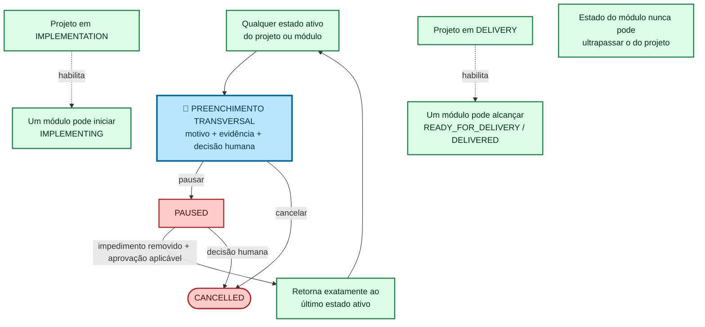
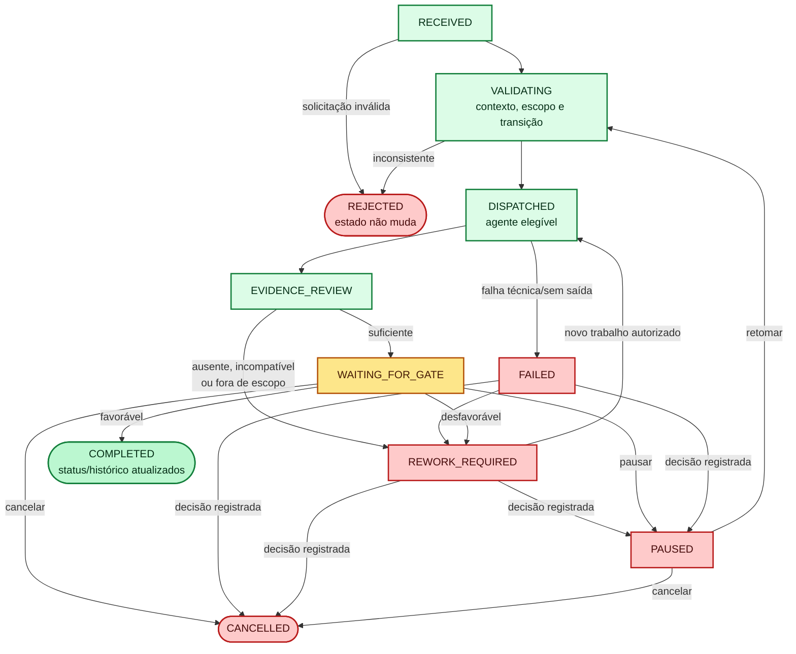
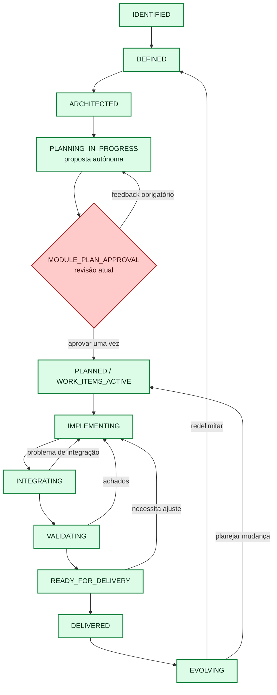

# Bússola do ciclo de vida NAAMIVE

> Um mapa visual do funcionamento do NAAMIVE, da necessidade de negócio à entrega e evolução do produto.

Este mapa é uma visão de navegação das máquinas normativas. Em caso de conflito,
prevalecem [a máquina pré-projeto](PRE_PROJECT_LIFECYCLE.md), [a máquina de
projeto](PROJECT_LIFECYCLE.md), [a máquina de módulo](MODULE_LIFECYCLE.md) e o
[protocolo de orquestração](ORCHESTRATION_PROTOCOL.md). Setas são transições
permitidas — não são autorização automática para executá-las.

## Mapa geral: da ideia ao próximo ciclo

```mermaid
flowchart TB
  classDef start fill:#dcfce7,stroke:#15803d,color:#052e16,stroke-width:2px;
  classDef path fill:#dcfce7,stroke:#15803d,color:#052e16,stroke-width:2px;
  classDef registrationGate fill:#fde68a,stroke:#b45309,color:#451a03,stroke-width:3px;
  classDef commitmentGate fill:#fde68a,stroke:#b45309,color:#451a03,stroke-width:3px;
  classDef acceptanceGate fill:#fde68a,stroke:#b45309,color:#451a03,stroke-width:3px;
  classDef modulePlanGate fill:#fde68a,stroke:#b45309,color:#451a03,stroke-width:3px;
  classDef humanData fill:#bae6fd,stroke:#0369a1,color:#082f49,stroke-width:3px;
  classDef done fill:#dcfce7,stroke:#15803d,color:#052e16,stroke-width:2px;
  classDef alt fill:#fecaca,stroke:#b91c1c,color:#450a0a,stroke-width:2px;
  classDef stop fill:#fecaca,stroke:#b91c1c,color:#450a0a,stroke-width:2px;

  idea([💡 Necessidade de negócio]):::start --> draft[DRAFT<br/>rascunho da solicitação]:::path
  draft --> intakeData[📝 PREENCHIMENTO 1<br/>completar solicitação]:::humanData
  intakeData -->|enviar| submitted[SUBMITTED]:::path
  submitted --> validating[VALIDATING<br/>validar formato, campos e fontes]:::path
  validating -->|inválida| rejected[REJECTED<br/>sem projeto]:::stop
  rejected --> correctionData[📝 PREENCHIMENTO 2<br/>corrigir a solicitação]:::humanData
  correctionData --> draft
  validating -->|válida| registration[WAITING_FOR_REGISTRATION]:::path
  registration --> registrationData[📝 PREENCHIMENTO 3<br/>registrar a decisão]:::humanData
  registrationData --> registerGate{🛑 GATE 1 — REGISTRO<br/>aprovação humana:<br/>REGISTER_PROJECT}:::registrationGate
  registerGate -->|aprovar| analysis[ANALYSIS<br/>entender problema e valor]:::path
  registerGate -->|rejeitar / pedir ajustes| rejected
  registerGate -->|cancelar| intakeCancelled([CANCELLED<br/>solicitação encerrada]):::stop
  draft -. cancelar .-> intakeCancelled
  submitted -. cancelar .-> intakeCancelled
  validating -. cancelar .-> intakeCancelled

  analysis --> definition[DEFINITION<br/>requisitos e módulos candidatos]:::path
  definition --> commitmentData[📝 PREENCHIMENTO 4<br/>declarar módulos candidatos<br/>e decisão]:::humanData
  commitmentData --> commitmentGate{🛑 GATE 2 — COMPROMISSO<br/>aprovação humana:<br/>PRODUCT_COMMITMENT}:::commitmentGate
  commitmentGate -->|aprovar| architecture[ARCHITECTURE<br/>arquitetura e integrações]:::path
  commitmentGate -->|pedir retrabalho| definition
  architecture --> planning[PLANNING<br/>proposta autônoma, riscos e dependências]:::path
  planning --> modulePlanGate{🛑 GATE DE MÓDULO<br/>aprovação única:<br/>MODULE_PLAN_APPROVAL}:::modulePlanGate
  modulePlanGate -->|aprovar proposta atual| implementation[IMPLEMENTATION<br/>construir]:::path
  modulePlanGate -->|solicitar ajustes com feedback| planning
  implementation --> validation[VALIDATION<br/>validar produto integrado]:::path
  validation -->|aprovado| delivery[DELIVERY<br/>release, implantação e handover]:::path
  validation -->|achados → retrabalho| implementation
  delivery --> acceptanceData[📝 PREENCHIMENTO 5<br/>registrar o aceite]:::humanData
  acceptanceData --> acceptanceGate{🛑 GATE 3 — ACEITE<br/>aprovação humana:<br/>aceite da entrega}:::acceptanceGate
  acceptanceGate -->|aprovar| delivered[DELIVERED<br/>entrega aceita]:::done
  acceptanceGate -->|recusar / achados| validation
  delivery -->|falha/achados| validation
  delivered -->|nova necessidade rastreável| evolution[EVOLUTION<br/>mudança controlada]:::path
  evolution -->|redescoberta| analysis
  evolution -->|mudança planejável| planning

  analysis -. decisão humana .-> cancelled([CANCELLED<br/>artefatos preservados]):::stop
  definition -.-> cancelled
  architecture -.-> cancelled
  planning -.-> cancelled
  implementation -.-> cancelled
  validation -.-> cancelled
  delivery -.-> cancelled
  evolution -.-> cancelled
```

  🎨 <strong>Legenda:</strong> 🟩 estado normal &nbsp;·&nbsp; 🟦 📝 preenchimento humano &nbsp;·&nbsp; 🟨 🛑 gate de aprovação &nbsp;·&nbsp; 🟥 parada, impedimento ou falha

## Trilhos laterais: pausa, cancelamento e escopo de módulo

`CANCELLED` é terminal e preserva a evidência; não equivale a apagar o projeto.
No intake, o cancelamento pode ocorrer em `DRAFT`, `SUBMITTED`, `VALIDATING` ou
`WAITING_FOR_REGISTRATION`. A exclusão permanente, quando permitida, é uma
operação separada e só pode ocorrer depois do cancelamento.

## Caminho interno de cada movimento (a trilha de auditoria)

Uma execução `REJECTED`, `FAILED` ou em `REWORK_REQUIRED` não promove o estado
do projeto/módulo. Só uma decisão de gate favorável com as evidências exigidas
registra a transição.

## Mapa do módulo: a esteira paralela da capacidade de negócio

Para todos os estados ativos do módulo, valem os mesmos trilhos de `PAUSED` e
`CANCELLED` mostrados acima. O módulo só é materializado após o compromisso de
produto; ele é uma capacidade de negócio, e não uma camada técnica.

> **Alinhamento com o runtime:** a máquina normativa de módulo chama a etapa
> planejada de `PLANNED`. O runtime web detalha essa mesma etapa como
> `PLANNING_IN_PROGRESS` (proposta em elaboração ou revisão) e
> `WORK_ITEMS_ACTIVE` (proposta aprovada e itens autorizados). Esses nomes de
> projeção não criam gates extras nem substituem os estados normativos.

## Como interpretar o fluxo

- **Começo correto:** sem `--project` ou `--request`, nada é criado; uma
  solicitação inválida termina em `REJECTED` e não cria projeto.
- **Gates certos:** registro do projeto, compromisso de produto e aceite da
  entrega requerem decisão humana. Além deles, cada módulo tem um único gate
  `MODULE_PLAN_APPROVAL`: a pessoa aprova a proposta inteira ou pede ajustes
  auditáveis; não aprova work items individualmente.
- **Voltas corretas:** achados de produto voltam de `VALIDATION` para
  `IMPLEMENTATION`; achados de entrega voltam de `DELIVERY` para `VALIDATION`.
  Na execução, todo retrabalho volta para `DISPATCHED`.
- **Parada segura:** pausar retoma apenas o último estado ativo; cancelar é
  terminal e deixa a trilha auditável intacta.
- **Limite de autoridade:** agente produz evidência e pede a transição; nunca
  aprova gate humano nem altera `STATUS.md` diretamente.
- **Rastreabilidade:** confira `STATUS.md`, `STATUS_HISTORY.md`, contexto,
  despacho, evidências e decisão de gate para cada avanço.

## Gates humanos: pare aqui

| Cor | Gate | Quando parar | Só avança com |
| --- | --- | --- | --- |
| 🟨 amarelo | `REGISTER_PROJECT` | Solicitação já validada | decisão humana de registrar a necessidade como projeto |
| 🟨 amarelo | `PRODUCT_COMMITMENT` | Requisitos e módulos candidatos definidos | decisão humana de assumir escopo, investimento e riscos |
| 🟨 amarelo | `MODULE_PLAN_APPROVAL` | Proposta automática de work items do módulo pronta | aprovar a revisão atual inteira, ou solicitar ajustes com feedback não vazio |
| 🟨 amarelo | aceite de entrega | Release, operação e handover prontos | decisão humana de aceitar a entrega de negócio |

Os três losangos de projeto e o gate único de plano por módulo são as paradas humanas ordinárias. Gates humanos
condicionais (risco material, exceção, produção de alto risco, segurança ou
compliance) usam a decisão registrada aplicável e também interrompem o avanço.

## Preenchimentos humanos: complete antes de seguir

Os retângulos **azuis** com `📝` são paradas obrigatórias para fornecer ou
completar dados. Eles não substituem o gate logo adiante: primeiro a pessoa
registra as informações, depois a autoridade toma a decisão.

| Estação azul | Onde ocorre | Dados que a pessoa precisa preencher/registrar |
| --- | --- | --- |
| `PREENCHIMENTO 1` | `DRAFT`, antes de enviar | `request_id`, `proposed_project_id`, título, dono de negócio, solicitante, problema, resultado observável, métrica, stakeholders, restrições, evidências/fontes, premissas e questões em aberto. |
| `PREENCHIMENTO 2` | após `REJECTED` | Corrigir os campos apontados: formato, obrigatórios, identificadores, fontes ou escolha técnica indevida. Depois, reenviar a solicitação. |
| `PREENCHIMENTO 3` | antes de `REGISTER_PROJECT` | Resultado da decisão: autoridade/`decided_by`, base de autoridade, evidências revisadas, justificativa (`rationale`) e decisão de aprovar ou rejeitar/pedir ajustes. |
| `PREENCHIMENTO 4` | antes de `PRODUCT_COMMITMENT` | Dados da decisão acima **e**, para cada módulo candidato: `module_id`, título, justificativa e responsável. |
| `PREENCHIMENTO 5` | antes do aceite de entrega | Dados da decisão acima, incluindo evidências de entrega, operação e handover revisadas e a justificativa do aceite ou da recusa. |
| `PREENCHIMENTO TRANSVERSAL` | de qualquer estado ativo para `PAUSED` ou `CANCELLED` | Motivo, evidência e decisão humana registrada. Na retomada, registrar que o impedimento foi removido e a aprovação aplicável. |

Quando um gate devolver `REWORK_REQUIRED`, a pessoa deve registrar o feedback
auditável: itens recusados, evidências, ajustes propostos, responsável e
critério para nova submissão. O fluxo então retorna ao trabalho necessário,
sem avanço de estado.

## Referência de todos os status do mapa

Esta tabela cobre os status normativos das máquinas desenhadas acima. O mapa
de módulo também mostra as projeções operacionais explicadas na nota de
alinhamento. **Caixa no mapa** indica a caixinha onde o status aparece; o
texto entre parênteses ajuda a localizá-la rapidamente. A responsabilidade
por uma fase não transfere para um agente a decisão de um gate humano.
`governance-assurance` acompanha os controles e a rastreabilidade de qualquer
etapa quando necessário.

**Fase** é o trabalho realizado enquanto o item permanece no status indicado,
até que haja evidência e controle para a próxima transição. **Ator
responsável** é o dono primário desse trabalho; pode ser uma pessoa, a
orquestração ou um agente do catálogo.

| # | Máquina | Status | Mensagem amigável | Motivo / condição | Fase (até a próxima transição) | Ator responsável | Caixa no mapa | Timeline da tela |
| ---: | --- | --- | --- | --- | --- | --- | --- | --- |
| 1 | Intake | `DRAFT` | Rascunho pronto para ser completado. | A necessidade foi criada, mas ainda não foi enviada. | Preenchimento da solicitação | usuário; `business-intake` apoia | Mapa geral — `DRAFT` | Sim — “Projeto criado” |
| 2 | Intake | `SUBMITTED` | Necessidade enviada; vamos verificar as informações. | A pessoa enviou o rascunho para validação. | Qualificação do intake | `business-intake` | Mapa geral — `SUBMITTED` | Sim — “Necessidade enviada” |
| 3 | Intake | `VALIDATING` | Validando campos, formato e fontes. | A solicitação está sob verificação. | Validação do intake | `business-intake` | Mapa geral — `VALIDATING` | Não |
| 4 | Intake | `REJECTED` | São necessários ajustes antes de continuar. | Há campo ausente, formato inválido, fonte insuficiente ou escolha técnica indevida. | Correção da solicitação | usuário | Mapa geral — `REJECTED` | Não |
| 5 | Intake | `WAITING_FOR_REGISTRATION` | Solicitação válida; aguardando decisão de registro. | A validação passou e o gate `REGISTER_PROJECT` ainda não foi decidido. | Decisão de registro | pessoa autorizada; `governance-assurance` verifica | Mapa geral — `WAITING_FOR_REGISTRATION` | Sim — “Necessidade validada” |
| 6 | Intake | `REGISTERED` | Projeto registrado e pronto para descoberta. | O gate `REGISTER_PROJECT` foi aprovado. | Materialização e repasse ao projeto | orquestração; `business-analysis` recebe o contexto | Caminho após `GATE 1 — REGISTRO` | Sim — “Projeto registrado” |
| 7 | Intake | `CANCELLED` | Solicitação encerrada; evidências preservadas. | Cancelamento humano registrado antes de criar o projeto. | Encerramento auditável | pessoa autorizada; `governance-assurance` verifica | Mapa geral — `CANCELLED` da solicitação | Não |
| 8 | Projeto | `ANALYSIS` | Entendendo o problema, valor e restrições. | O projeto foi registrado ou a evolução exige nova descoberta. | Análise de negócio | `business-analysis` (PM/BA) | Mapa geral — `ANALYSIS` | Sim — “Descoberta iniciada” |
| 9 | Projeto | `DEFINITION` | Definindo requisitos e capacidades candidatas. | A análise possui evidência suficiente para avançar. | Definição de domínio e requisitos | `domain-modeling` + `requirements-engineering` | Mapa geral — `DEFINITION` | Sim — “Necessidade analisada” / “Requisitos definidos” |
| 10 | Projeto | `ARCHITECTURE` | Decidindo arquitetura e integrações. | O compromisso de produto foi aprovado. | Arquitetura da solução | `solution-architecture` | Mapa geral — `ARCHITECTURE` | Não |
| 11 | Projeto | `PLANNING` | Planejando entrega, riscos e dependências. | A arquitetura está registrada e apta a ser planejada. | Planejamento da entrega | `delivery-planning` (PM de entrega) | Mapa geral — `PLANNING` | Sim — “Arquitetura aprovada” |
| 12 | Projeto | `IMPLEMENTATION` | Construindo os itens autorizados. | O plano, dependências e controles necessários foram aprovados. | Implementação | `implementation`; `integration-engineering` quando aplicável | Mapa geral — `IMPLEMENTATION` | Sim — “Desenvolvimento iniciado” |
| 13 | Projeto | `VALIDATION` | Validando o produto integrado. | A implementação e a integração estão disponíveis para verificação. | Qualidade e segurança | `quality-assurance` (QA) + `security-assurance` conforme risco | Mapa geral — `VALIDATION` | Sim — “QA aprovado” / “QA encontrou pendência” |
| 14 | Projeto | `DELIVERY` | Preparando release, implantação e handover. | A validação passou, com qualidade e risco residual explícitos. | Release e handover | `release-operations` | Mapa geral — `DELIVERY` | Não |
| 15 | Projeto | `DELIVERED` | Entrega aceita e registrada. | O aceite de entrega foi aprovado. | Acompanhamento pós-entrega | pessoa dona do negócio | Mapa geral — `DELIVERED` | Não |
| 16 | Projeto | `EVOLUTION` | Avaliando uma mudança controlada. | Surgiu uma nova necessidade rastreável após a entrega. | Triagem da evolução | `business-analysis` ou `delivery-planning`, conforme o retorno | Mapa geral — `EVOLUTION` | Não |
| 17 | Projeto | `PAUSED` | Trabalho pausado; aguardando remoção do impedimento. | Pausa humana registrada com motivo e evidência. | Gestão de impedimento | pessoa autorizada; `governance-assurance` verifica | Trilhos laterais — `PAUSED` | Não |
| 18 | Projeto | `CANCELLED` | Projeto encerrado; artefatos preservados. | Cancelamento humano registrado em qualquer estado ativo. | Encerramento auditável | pessoa autorizada; `governance-assurance` verifica | Mapa geral / Trilhos laterais — `CANCELLED` | Não |
| 19 | Execução | `RECEIVED` | Solicitação de trabalho recebida. | A orquestração recebeu uma nova execução. | Recebimento da execução | orquestração | Trilha de auditoria — `RECEIVED` | Não |
| 20 | Execução | `VALIDATING` | Conferindo contexto, escopo e transição. | A execução ainda precisa passar pelas pré-condições. | Validação de contexto | orquestração; `governance-assurance` quando necessário | Trilha de auditoria — `VALIDATING` | Não |
| 21 | Execução | `DISPATCHED` | Trabalho encaminhado ao agente elegível. | Contexto e despacho foram validados. | Produção do trabalho despachado | agente definido no despacho | Trilha de auditoria — `DISPATCHED` | Não |
| 22 | Execução | `EVIDENCE_REVIEW` | Conferindo as evidências produzidas. | O agente devolveu saídas que precisam ser verificadas. | Revisão independente de evidências | `governance-assurance` + revisor aplicável | Trilha de auditoria — `EVIDENCE_REVIEW` | Não |
| 23 | Execução | `WAITING_FOR_GATE` | Evidências prontas; aguardando gate aplicável. | A revisão foi suficiente e a decisão ainda não ocorreu. | Decisão de gate | pessoa autorizada; `governance-assurance` verifica | Trilha de auditoria — `WAITING_FOR_GATE` | Não |
| 24 | Execução | `REWORK_REQUIRED` | Há ajustes a fazer antes de avançar. | Evidência ausente, incompatível, fora de escopo ou gate desfavorável. | Retrabalho autorizado | agente do novo despacho | Trilha de auditoria — `REWORK_REQUIRED` | Não |
| 25 | Execução | `COMPLETED` | Trabalho concluído e registrado. | O gate aplicável foi favorável e o resultado foi gravado. | Registro do resultado | orquestração | Trilha de auditoria — `COMPLETED` | Não |
| 26 | Execução | `REJECTED` | Solicitação recusada; nada foi executado. | Contexto, escopo ou transição eram inválidos. | Recusa de contexto inválido | orquestração | Trilha de auditoria — `REJECTED` | Não |
| 27 | Execução | `FAILED` | A execução falhou sem condições de avançar. | Falha técnica ou ausência de saída suficiente do agente. | Diagnóstico e recuperação | agente do despacho; orquestração registra | Trilha de auditoria — `FAILED` | Não |
| 28 | Execução | `PAUSED` | Execução pausada; aguardando decisão de retomada. | Decisão registrada interrompeu a execução. | Gestão de impedimento | pessoa autorizada; `governance-assurance` verifica | Trilha de auditoria — `PAUSED` | Não |
| 29 | Execução | `CANCELLED` | Execução cancelada e auditada. | Decisão registrada encerrou a execução. | Encerramento auditável | pessoa autorizada; `governance-assurance` verifica | Trilha de auditoria — `CANCELLED` | Não |
| 30 | Módulo | `IDENTIFIED` | Capacidade identificada; ainda precisa ser delimitada. | O módulo foi reconhecido após o compromisso de produto. | Identificação da capacidade | `domain-modeling` | Mapa do módulo — `IDENTIFIED` | Sim — “Módulo criado” |
| 31 | Módulo | `DEFINED` | Domínio, necessidade e requisitos do módulo estão definidos. | A capacidade passou por revisão independente. | Definição do módulo | `domain-modeling` + `requirements-engineering` | Mapa do módulo — `DEFINED` | Sim — “Módulo aprovado” |
| 32 | Módulo | `ARCHITECTED` | Interfaces e arquitetura interna estão definidas. | Requisitos e critérios de aceite estão consistentes. | Arquitetura do módulo | `solution-architecture` | Mapa do módulo — `ARCHITECTED` | Sim — “Definição concluída” |
| 33 | Módulo | `PLANNED` | Trabalho, dependências e pronto para entrega foram planejados. | Arquitetura e dependências foram registradas; no runtime, a etapa aparece como `PLANNING_IN_PROGRESS` ou `WORK_ITEMS_ACTIVE`. | Planejamento e ativação dos itens | `delivery-planning` (PM de entrega) | Mapa do módulo — `PLANNING_IN_PROGRESS` / `WORK_ITEMS_ACTIVE` | Sim — “Arquitetura aprovada” |
| 34 | Módulo | `IMPLEMENTING` | Construindo os artefatos autorizados do módulo. | Itens, riscos e dependências foram tratados. | Desenvolvimento do módulo | `implementation` (Dev) | Mapa do módulo — `IMPLEMENTING` | Sim — “Desenvolvimento iniciado” |
| 35 | Módulo | `INTEGRATING` | Verificando contratos e fluxos integrados. | Implementação e testes locais estão disponíveis. | Integração de contratos e fluxos | `integration-engineering` | Mapa do módulo — `INTEGRATING` | Sim — “Entrega incorporada à fase” |
| 36 | Módulo | `VALIDATING` | Validando requisitos, qualidade e segurança do módulo. | Contratos e fluxos integrados foram verificados. | Qualidade e segurança do módulo | `quality-assurance` (QA) + `security-assurance` conforme risco | Mapa do módulo — `VALIDATING` | Sim — “QA aprovado” / “QA encontrou pendência” |
| 37 | Módulo | `READY_FOR_DELIVERY` | Módulo pronto para compor a entrega. | Requisitos, qualidade e segurança têm evidências suficientes. | Preparação para entrega | `release-operations` | Mapa do módulo — `READY_FOR_DELIVERY` | Sim — “QA aprovado” |
| 38 | Módulo | `DELIVERED` | Módulo participou de uma entrega aceita. | O projeto concluiu o controle de entrega correspondente. | Acompanhamento pós-entrega | pessoa dona do negócio | Mapa do módulo — `DELIVERED` | Sim — “Fase integrada” |
| 39 | Módulo | `EVOLVING` | Módulo recebendo mudança controlada. | Há mudança rastreável após a entrega. | Triagem da evolução | `business-analysis` ou `delivery-planning`, conforme a mudança | Mapa do módulo — `EVOLVING` | Não |
| 40 | Módulo | `PAUSED` | Módulo pausado; aguardando remoção do impedimento. | Pausa humana registrada com motivo e evidência. | Gestão de impedimento | pessoa autorizada; `governance-assurance` verifica | Trilhos laterais — `PAUSED` | Não |
| 41 | Módulo | `CANCELLED` | Módulo encerrado; histórico preservado. | Cancelamento humano registrado em estado ativo. | Encerramento auditável | pessoa autorizada; `governance-assurance` verifica | Trilhos laterais — `CANCELLED` | Não |
