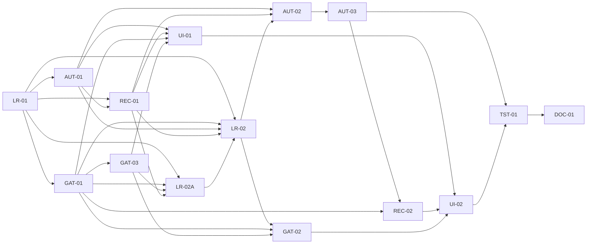

# Planejamento da Fase 6.5 — Lifecycle Alignment and Autonomous Orchestration Recovery

## Objetivo

Restabelecer a aderência entre lifecycle normativo, workflows publicados,
runtime, persistência, APIs, UI, automação, recovery, gates, assurance e testes
antes do início da Fase 7. A Fase 6.5 transforma a baseline de não conformidades
em um backlog executável, compatível com os dados e contratos certificados até
a Fase 6.

Esta fase é governada pelo princípio:

> **AUTOMATION FIRST, HUMAN BY EXCEPTION OR EXPLICIT GATE.**

Depois que um escopo foi autorizado, o orquestrador deve tentar conduzi-lo até
um gate humano explícito, uma decisão material, um bloqueio não solucionável
automaticamente, uma falha que realmente exija autoridade humana ou a conclusão.

## Motivação, contexto e baseline

A baseline oficial é
`orchestration/audits/2026-08-22-lifecycle-conformance-audit.md`. Ela permanece
imutável como fotografia histórica anterior às correções. Sua conclusão é que o
runtime atual não representa o modelo operacional normativo: a jornada real
depende de comandos humanos entre estados técnicos, possui estados recuperáveis
em limbo, aplica F6 somente a parte dos trabalhos reais e não conduz projeto e
módulo até entrega aceita.

Este plano usa integralmente o resumo executivo, os lifecycles esperado e atual,
a matriz de aderência, a análise do projeto real, os estados em limbo, os gates,
as paradas humanas indevidas, as automações ausentes, os problemas de UI, o plano
ordenado e os critérios finais da auditoria. A auditoria não é reinterpretada nem
atualizada por esta fase.

## Checkpoint vivo de execução — 2026-08-24

`LR-01`, `GAT-01`, `GAT-03`, `AUT-01`, `REC-01`, `LR-02A` e `LR-02` estão
`DONE`; os dois findings da auditoria de `9e9bdaf0` foram fechados. LR-02
implementou `COMMITTED_MODULE_EVOLUTION_POLICY:v1`, o required-set efetivo,
intents/outbox recuperáveis e agregação macro versionada sem antecipar GAT-02
ou AUT-02. O required-set usa `CommittedModuleObligation:v1`, logo obrigação
aprovada não desaparece por ainda não possuir `module_id`. A sequência
efetivamente concluída é
`LR-01 → GAT-01 → GAT-03 → AUT-01 → REC-01 → LR-02A → LR-02`.

LR-02A publicou o contrato canônico em `gate_records` (não na tabela legada
`gates`) e separou o schema de materialization lineage da execução macro que
continua pertencendo a LR-02.

O finding LR-02A-FIX-01 foi encerrado aditivamente pela migration 062. Uma
revisão aprovada pode receber proposta sucessora sem perder a autoridade
corrente; a aprovação seguinte troca predecessor/sucessora atomicamente,
preserva uma única `APPROVED` e mantém lineage através de rework rejeitado.

No backlog original, AUT-01 dependia conceitualmente de LR-01 porque consome o
contrato do lifecycle. A fronteira final de execução registrada na task é
`[LR-01, GAT-01, GAT-03]`: além do lifecycle, o scheduler requer catálogo de
autoridade e identidade/RBAC verificáveis. A distinção preserva o planejamento
original. REC-01 preserva dependência conceitual em LR-01 e possui fronteira
funcional `[LR-01, AUT-01]`, porque administra attempts/reservations/jobs
publicados por AUT-01; GAT-01/GAT-03 permanecem guardrails de autoridade.

## Problemas identificados

- O plano aprovado materializa WIs em um estado de autorização humana individual.
- Não há scheduler transacional que reaja a elegibilidade e dependências.
- Descoberta, materialização, QA, review, merge, candidata, validação e integração
  dependem de operações manuais em pontos tecnicamente automatizáveis.
- O macro-lifecycle de projeto e módulo não acompanha o trabalho real até
  `VALIDATION`, `DELIVERY` e `DELIVERED`.
- O micro-lifecycle F6 não alcança desenvolvimento, planejamento, integração,
  QA, segurança e release reais.
- Retry, restart, resume e rework não são selecionados pela causa; reviewer,
  blocks, escalada e integração possuem caminhos incompletos.
- Gates implícitos ou universais substituem avaliação de materialidade, enquanto
  aceite final, pausa e cancelamento normativos estão ausentes.
- Identidade e autoridade não são verificáveis de forma uniforme.
- A UI possui renderers concorrentes, deriva ações e não explica todas as paradas.
- Testes e documentos certificados reforçam simultaneamente contratos
  incompatíveis.

## Escopo

- publicar novas versões aderentes dos workflows, sem editar versões publicadas;
- sincronizar os estados agregados de projeto e módulo;
- automatizar elegibilidade, dispatch, QA, review, merge, candidata, validação e
  integração;
- ampliar supervision/assurance aos trabalhos reais selecionados;
- estabelecer recovery orientado pela causa e recuperação de reviewer/blocks;
- publicar catálogo server-side de gates e autoridade, autenticação/RBAC, entrega,
  pausa, retomada e cancelamento;
- unificar projeção server-side e superfícies de UI;
- criar suíte de conformidade do lifecycle e reconciliar a documentação;
- preservar o projeto real da auditoria como cenário obrigatório de regressão.

## Fora de escopo

- qualquer correção funcional durante esta task de preparação;
- reescrever migrations ou workflows já publicados;
- alterar a baseline da auditoria ou declarar suas não conformidades resolvidas;
- iniciar a Fase 7, abrir PR draft, remover o runtime Python ou ampliar o produto
  para múltiplas organizações;
- transformar a UI em console de operação manual do workflow técnico;
- renumerar a Fase 7 ou falsificar o histórico de F5/F6.

## Princípios arquiteturais

1. Nenhum WI coberto por um plano aprovado exige autorização humana individual.
2. Elegibilidade e dependência satisfeita provocam reavaliação e dispatch.
3. Produção concluída provoca QA e review automaticamente.
4. `EXECUTION_SUCCEEDED != WORK_ACCEPTED`; somente `ACCEPT` aceita trabalho.
5. `REWORK` retorna ao ciclo automaticamente, salvo decisão material explícita.
6. `BLOCK` tenta assistência, routing e especialista antes de escalar.
7. Falha recuperável possui saída operacional válida e auditável.
8. Gates humanos existem somente no lifecycle/política e são proporcionais.
9. A UI explica o lifecycle e coleta decisões autorizadas; não o conduz por cliques.
10. Projeto e módulo avançam de forma coerente e transacional.
11. Toda ação, decisão, tentativa e evidência permanece rastreável.
12. Estados automáticos não geram paradas humanas implícitas.
13. Toda parada humana informa motivo, espera, autoridade, decisões e continuação.

## Invariantes

- Definições publicadas são imutáveis; mudança semântica cria nova versão.
- Dados históricos preservam workflow/version, estado, evidência e lineage.
- A migração de uma instância ativa nunca é silenciosa: requer classificação,
  plano explícito e evidência de resultado.
- A seleção do próximo trabalho, a criação do job e o evento correspondente são
  atômicos e idempotentes.
- Dependência técnica só é satisfeita por predecessor aceito e integrado, não por
  execução tecnicamente bem-sucedida.
- Bloqueio externo pode coexistir em cardinalidade maior que um e sua resolução
  não apaga o histórico nem mantém metadado ativo obsoleto.
- Um handoff automático não promove o trabalho além do controle previsto.
- Cancelamento é terminal e preserva evidência; não equivale a arquivamento ou
  exclusão. Pausa retorna exatamente ao último estado ativo válido.
- Ação sensível é autorizada no servidor por identidade autenticada e escopo.
- `allowed_actions` é derivado de estado, causa, autoridade e política no servidor.
- Nenhum renderer, evento SSE ou reconciliador cria efeito de negócio duplicado.

## Estratégia de compatibilidade

- Publicar workflows novos e manter versões F3/F4/F5/F6 consultáveis.
- Preservar o caminho legado enquanto a política de rollout estiver desligada,
  sem reinterpretar resultados históricos como aceites F6. Essa coexistência é
  uma estratégia de transição, não uma obrigação de manter indefinidamente o
  fluxo operacional incorreto fora de assurance.
- Substituir, em novos workflows e dispatches selecionados, o comportamento
  operacional legado pelos contratos corretivos da Fase 6.5, inclusive a
  cobertura F6 dos trabalhos reais pela `AUT-03`.
- Mapear consumidores antes de mudar contratos; APIs incompatíveis usam versão ou
  período de coexistência explícito.
- Manter referências de baseline tecnológica e garantias Git/F3 em todo novo
  handoff.
- Registrar em `DOC-01` conflitos históricos de F5/F6; não alterar tasks antigas
  para fingir que já implementavam o contrato futuro.

## Estratégia de migração

1. Inventariar workflows/estados/transições e linhas por versão.
2. Publicar migrations aditivas, repetíveis e validadas em PostgreSQL real.
3. Classificar linhas legadas, inclusive `WAITING_FOR_WORK_ITEM_AUTHORIZATION`,
   `QA_IN_PROGRESS`, `EVIDENCE_REVIEW`, `REWORK_ELIGIBLE` e estados agregados.
4. Definir por classe: permanência histórica, adoção por novo dispatch ou
   migração explícita com pré-condições e evidência.
5. Nunca editar definição publicada nem migrar instância ambígua.
6. Fornecer roll-forward idempotente como recuperação primária. Rollback de
   política afeta apenas novos dispatches; rollback de schema só quando seguro e
   sem perda de dados.

## Estratégia de rollout

- Entregar por contratos fundacionais, automação, recovery/gates, UI e certificação.
- Ativar comportamento por versão/política e projeto de teste antes do default.
- Executar coexistência com dados legados e o cenário real da auditoria.
- Medir elegibilidade sem dispatch, handoff pendente, tempo até review, limbos,
  retries, blocks e escaladas.
- Suspender novos dispatches da versão nova se um invariante falhar; preservar os
  dispatches já criados e usar recovery orientado pela causa.

## Estratégia de recovery

- Classificar causa antes da ação: transiente técnico → retry; processo perdido
  sem evidência → restart; lease/processo retomável → resume/reconcile; evidência
  ou finding → rework; Git/integração → recuperação específica.
- Derivar no servidor delivery, SHA, findings, origem, versão e ação válida.
- Reconciliar handoffs incompletos após crash com chaves determinísticas.
- Reeleger reviewer, abrir/deduplicar block e despachar assistência/especialista
  antes de gate humano.
- Expor exatamente uma ação humana quando a automação se esgotar ou a autoridade
  material for necessária.

## Estratégia de testes

- unitários para estados, guards, políticas, causa de recovery, RBAC e projeções;
- persistência PostgreSQL para migrations, constraints, concorrência e idempotência;
- integração para scheduler, eventos, handoffs, reconciliador e macro-agregação;
- HTTP/SSE/UI para contratos, autorização, mensagens, replay e ausência de ações
  técnicas manuais;
- E2E para happy path, dependências, rework, block, retry, restart, gates, pausa,
  cancelamento, entrega e crash entre handoffs;
- coexistência das versões antigas e regressão integral do projeto real auditado;
- build, typecheck, links/documentos e `git diff --check` no aceite final.

## Backlog da fase

| Ordem lógica | Task | Objetivo | Dependências |
| ---: | --- | --- | --- |
| 1 | `LR-01` | Publicar workflows aderentes e versionados. | — |
| 2 | `GAT-01` | Tornar gates e autoridades uma política server-side explícita. | LR-01 |
| 3 | `GAT-03` | Autenticar identidade e aplicar RBAC às ações sensíveis. | GAT-01 |
| 4 | `AUT-01` | Despachar WIs elegíveis transacionalmente. | LR-01 |
| 5 | `REC-01` | Selecionar recovery pela causa e eliminar ações ambíguas. | LR-01, AUT-01 |
| 6A | `LR-02A` | Publicar módulos canônicos do compromisso de produto. | LR-01, GAT-01, GAT-03, REC-01 |
| 6 | `LR-02` | Sincronizar macro-lifecycle e automações de passagem macro. | LR-01, GAT-01, AUT-01, REC-01, LR-02A |
| 7 | `AUT-02` | Encadear QA, review, merge, candidata, validação e integração. | AUT-01, REC-01, LR-02 |
| 8 | `AUT-03` | Aplicar F6 aos trabalhos reais selecionados. | AUT-02 |
| 9 | `REC-02` | Recuperar reviewer e blocks com assistência/routing. | AUT-03, GAT-01 |
| 10 | `GAT-02` | Completar entrega, pausa, retomada e cancelamento. | LR-02, GAT-01, GAT-03 |
| 11 | `UI-01` | Unificar projeção de estado e `allowed_actions`. | AUT-01, REC-01, GAT-01, GAT-03 |
| 12 | `UI-02` | Cobrir todas as superfícies de parada e recovery. | UI-01, REC-02, GAT-02 |
| 13 | `TST-01` | Certificar um contrato único ponta a ponta. | todas as tasks funcionais |
| 14 | `DOC-01` | Reconciliar documentos sem reescrever o histórico. | TST-01 |

## Grafo de dependências

## Ordem final recomendada e justificativas

Sequência serial segura:

`LR-01 → GAT-01 → GAT-03 → AUT-01 → REC-01 → LR-02A → LR-02 → AUT-02 → AUT-03 → REC-02 → GAT-02 → UI-01 → UI-02 → TST-01 → DOC-01`.

Alterações em relação à ordem inicial da auditoria:

- `GAT-01` e `GAT-03` sobem para que estados, macro-transições e entrega não
  sejam construídos sobre gates implícitos ou identidade declarativa.
- `REC-01` permanece antes do pipeline automático: handoffs novos precisam
  nascer com saídas de recovery definidas.
- `LR-02` ocorre depois dos contratos/gates e antes do pipeline, separando a
  publicação das máquinas da reação agregada do runtime.
- `GAT-02` fica depois da sincronização macro e do RBAC, porque entrega, pausa e
  cancelamento dependem de estado agregado e autoridade verificável.
- UI fica depois de semânticas e ações server-side estáveis; `TST-01` e `DOC-01`
  fecham a fase sem servir como substitutos de testes dentro de cada task.

O paralelismo indicado na preparação era uma possibilidade de backlog, não uma
fronteira final de execução. Para AUT-01, a execução foi fechada após
`LR-01 → GAT-01 → GAT-03`; a ordem serial acima continua sendo a referência
conservadora para uma task por vez.

## Matriz de rastreabilidade auditoria → task

| Não conformidade da auditoria | Severidade | Task responsável | Critério de resolução |
| --- | --- | --- | --- |
| Registro exige clique para iniciar descoberta | ALTA | LR-02 | `REGISTER_PROJECT` aprovado cria/reavalia automaticamente o primeiro trabalho de análise. |
| Ajustes no `PRODUCT_COMMITMENT` têm representação indireta | NÃO CLASSIFICADA | GAT-01, UI-02 | Gate publica decisões e consequências normativas, inclusive rework/ajustes, sem tradução ambígua. |
| Materialização de módulos candidatos é manual | ALTA | LR-02 | Módulos comprometidos são materializados idempotentemente sem redigitação. |
| `MODULE_APPROVAL` duplica compromisso | ALTA | LR-01, GAT-01 | Gate é removido do fluxo ordinário ou aberto somente por condição material publicada. |
| Arquitetura sempre abre decisão humana | ALTA | GAT-01 | Review independente avança; gate humano só abre por materialidade demonstrada. |
| Baseline tecnológica é submetida a gate humano universal | NÃO CLASSIFICADA | GAT-01 | Controle humano abre somente quando materialidade/autoridade publicada exigir; evidência/review bastam no caso ordinário. |
| `MODULE_PLAN_APPROVAL` único e legítimo | CONFORME | LR-01, TST-01 | Gate do conjunto é preservado e não cria aprovações individuais. |
| Plano aprovado não agenda elegíveis | CRÍTICA | AUT-01 | Aprovação materializa e agenda raízes na mesma unidade recuperável. |
| `WAITING_FOR_WORK_ITEM_AUTHORIZATION` é gate individual | ALTA | LR-01, AUT-01 | Novos WIs usam espera técnica/filas; linhas legadas têm tratamento explícito. |
| Dependência satisfeita não provoca dispatch | CRÍTICA | AUT-01 | `ACCEPT`/integração/resolução reavaliam dependentes idempotentemente. |
| Desenvolvimento real não está integrado ao scheduler/F6 | MÉDIA | AUT-01, AUT-03 | Todo WI elegível segue dispatch e política de assurance aplicável. |
| `QA_IN_PROGRESS`/`EVIDENCE_REVIEW` param sem job | CRÍTICA | AUT-02 | Output cria QA/review automaticamente e crash é reconciliável. |
| `OUTPUT_SUBMITTED` só cobre discovery F6 | ALTA | AUT-03 | Políticas operacionais cobrem os job kinds reais definidos. |
| `ACCEPT` não promove o lifecycle real | ALTA | AUT-02, AUT-03 | Somente `ACCEPT` dispara promoção/integração uma vez. |
| `REWORK` exige novo start manual | CRÍTICA | REC-01, AUT-02 | Finding gera ciclo corretivo automático salvo gate material. |
| `BLOCK` não despacha assistência/especialista | ALTA | REC-02 | Block inicia diagnóstico, assistência, routing e retry antes de escalada. |
| Reviewer terminalmente indisponível fica em espera | CRÍTICA | REC-02 | Falha abre/deduplica block e tenta fallback/routing com saída visível. |
| `REWORK_ELIGIBLE` usa restart incompatível | CRÍTICA | REC-01 | Servidor distingue falha sem evidência de rework com evidência e projeta ação correta. |
| `WAITING_FOR_ESCALATION` não possui UI/gate completo | CRÍTICA | GAT-01, UI-02 | Gate publica motivo, autoridade, decisões, efeitos e ações autorizadas. |
| `READY_FOR_PHASE_MERGE` exige comando | ALTA | AUT-02 | `ACCEPT` agenda merge idempotente automaticamente. |
| Candidata, validação e integração exigem cliques | ALTA | AUT-02 | Handoffs técnicos são encadeados e recuperáveis. |
| Módulo fica em `WORK_ITEMS_ACTIVE` | CRÍTICA | LR-01, LR-02 | Módulo percorre implementar, integrar, validar e prontidão de entrega. |
| Projeto fica em materialização durante execução | CRÍTICA | LR-01, LR-02 | Estado agregado acompanha módulos sem avançar além das evidências. |
| Aceite final de entrega é inexistente | CRÍTICA | GAT-02 | Gate de entrega aprovado promove `DELIVERED`; rejeição volta com achados. |
| `PAUSED`/`CANCELLED` ausentes e archive conflita | ALTA | GAT-02 | Pausa retoma último estado e cancelamento terminal preserva evidência. |
| Bloqueios externos múltiplos/metadados obsoletos | MÉDIA | AUT-01, REC-01 | Todos os blockers persistem; resolução limpa projeção ativa e reavalia elegibilidade. |
| Ações sensíveis usam headers/rotas sem identidade forte | ALTA | GAT-03 | Identidade autenticada, escopo e papel são verificados no servidor e auditados. |
| Renderers concorrentes e ações inconsistentes | ALTA | UI-01 | Uma projeção e um dono de renderização usam `allowed_actions` server-side. |
| Documentação F5/F6 diverge do runtime | BAIXA | DOC-01 | Status, alcance e limitações são reconciliados sem alterar fatos históricos. |

Todas as não conformidades `CRÍTICA` e `ALTA` da matriz da auditoria possuem
task, dependência e critério de resolução. As linhas `MÉDIA` e `BAIXA` também
foram destinadas; a única linha conforme é preservada como regressão.

## Cenário real obrigatório de regressão

O projeto `728901f8-17fe-4fc9-bdc4-0b2fabc2ce08` é evidência histórica e
cenário de regressão; a suíte deve usar snapshot/fixture isolada ou clone
descartável equivalente, sem mutar o projeto original.

- **WI Persistência:** produção → QA automática → review independente →
  `ACCEPT` → merge automático.
- Depois do `ACCEPT`, todos os dependentes são reavaliados automaticamente.
- **WI Métrica:** sem decisão humana pendente, torna-se elegível e é despachado.
- **WI Interface:** permanece parado somente pela decisão externa legítima; após
  sua resolução e a dependência técnica satisfeita, é despachado automaticamente.

## Riscos e mitigação

| Risco | Mitigação |
| --- | --- |
| Migrar estado legado com semântica ambígua | Classificação explícita, dry-run, evidência e ausência de migração automática em dúvida. |
| Dispatch ou handoff duplicado por corrida/crash | Locks/constraints, chaves determinísticas, outbox e reconciliação idempotente. |
| Automação avançar sem `ACCEPT` | Guard transacional e regressão negativa em cada handoff. |
| F6 ampliar comportamento fora da política | Seletores publicados, coexistência e rollback apenas para novos dispatches. |
| Gate legítimo removido ou gate implícito preservado | Catálogo server-side versionado e testes de presença/ausência. |
| UI expor ação incompatível ou autoridade falsa | `allowed_actions` server-side e autorização repetida no comando. |
| Fase 7 duplicar/reverter correções da Fase 6.5 | Bloqueio explícito e reconciliação final em `DOC-01`. |
| Documento declarar aderência sem prova | `TST-01` exige PostgreSQL real e matriz de evidências antes de `DOC-01`. |

## Critérios globais de conclusão

1. Nenhum WI aprovado pelo plano exige autorização individual.
2. Todo WI elegível é despachado automaticamente e de forma idempotente.
3. Dependências satisfeitas provocam reavaliação automática.
4. Produção concluída gera QA e review sem comando humano.
5. Trabalho supervisionado permanece incompleto até `ACCEPT`.
6. `REWORK` gera ciclo corretivo automático quando não há gate material.
7. `BLOCK` provoca assistência/routing antes de escalada.
8. Toda falha recuperável possui saída operacional válida.
9. Nenhum estado recuperável permanece em limbo.
10. Gates humanos existem somente onde autorizados.
11. Toda parada humana explica motivo, autoridade, decisões e consequências.
12. Merge, candidata, validação e integração técnica são automatizados.
13. Projeto e módulo avançam coerentemente.
14. Existe aceite final de entrega.
15. `PAUSED` e `CANCELLED` possuem semântica normativa.
16. Ações sensíveis exigem identidade/autoridade adequada.
17. A UI utiliza uma única fonte de verdade para ações permitidas.
18. O cenário real completa automaticamente QA, review, merge e próximo dispatch.
19. E2E cobre happy path, rework, block, retry, dependências, gates e recovery.
20. Documentação, workflow, runtime, API, UI e testes representam o mesmo contrato.

## Registro histórico da preparação — 2026-08-22

Esta seção registra o estado do pacote quando o planejamento foi fechado; não é
o estado de execução atual. O checkpoint vivo acima e o índice de tasks são as
fontes para a retomada operacional.

## Critérios de conclusão deste planejamento

- plano, backlog, dependências, ordem e matriz estão publicados;
- todas as 14 tasks possuem arquivo próprio e status inicial `TO DO`;
- LR-01 está detalhada para ser a primeira implementação;
- roadmap inclui a Fase 6.5 e bloqueia explicitamente a Fase 7;
- nenhuma correção funcional, migration, API, UI ou scheduler foi implementado.

## Dependências externas e encerramento

Dependem de decisão/aprovação futura: política concreta de autenticação, critérios
de materialidade e autorização de rollout para dados reais. Essas decisões são
entradas das tasks correspondentes, não autorização para reduzir seu escopo.

Ao concluir este planejamento, a implementação funcional deve parar. A primeira
task posterior é `LR-01 — Publicar workflows aderentes v2`, executada somente após
revisão humana deste pacote, porque todas as automações dependem de estados,
transições, compatibilidade e migração definidos por ela.
